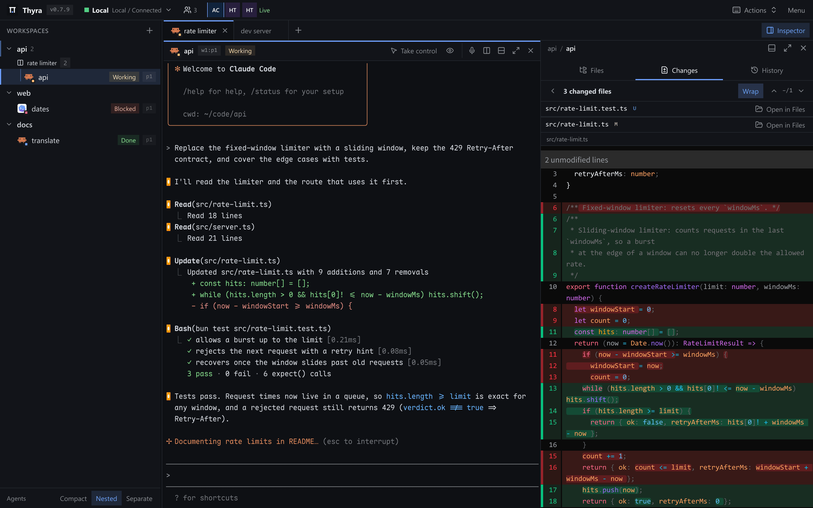
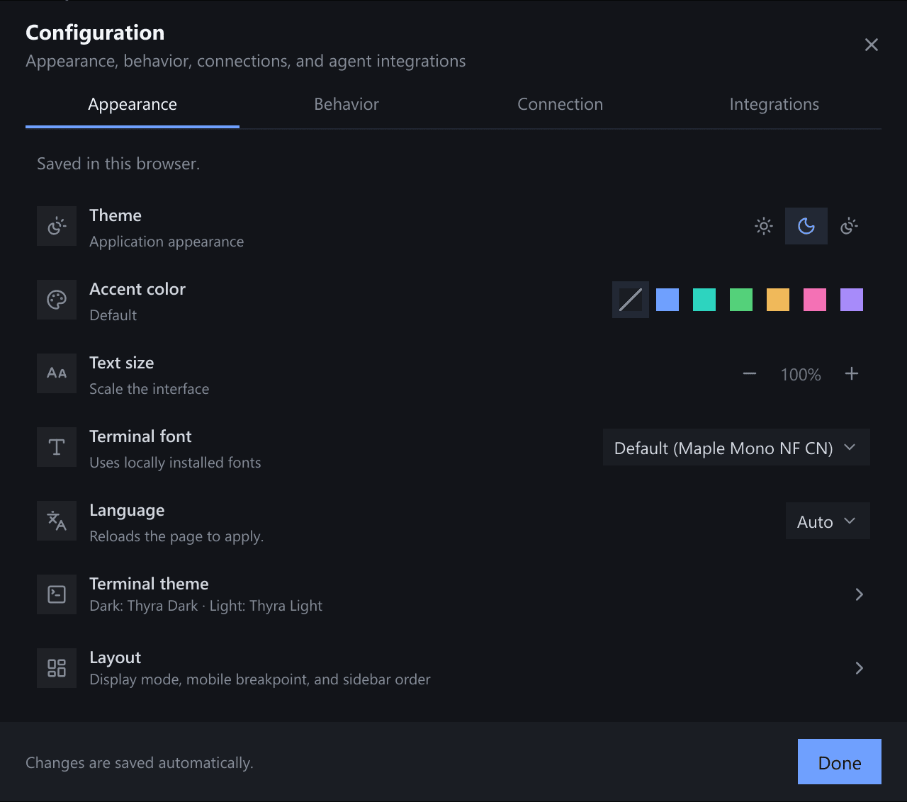

# Thyra Features

A Web/PWA client for a running [Herdr](https://herdr.dev) server.
[Install](./docs/DEPLOYMENT.md) · [Tutorial](./docs/TUTORIAL.md) ·
[Keyboard shortcuts](#keyboard-shortcuts)

## Workspace, Tab, and Pane Navigation

- Create, rename, pin, switch, and close workspaces/tabs. Linked Git worktrees
  group under their repository; pins and collapsed groups stay in this browser.
- Split right/down, resize, focus neighbors, zoom, or close panes.
- Search workspaces, worktrees, files, tabs, panes, and agents in the command
  menu. Enter a relative/absolute path to open a file.
- Desktop **Zen mode** hides app chrome. Hover the top edge to reveal controls
  or use **Exit Zen**; the sidebar restores its previous state on exit.

Every connection uses **Local navigation** per browser/connection: switching
workspaces or tabs never moves other clients. Reconnect preserves selections; reload
starts from Herdr's selection. Same-tab pane focus, topology, and terminal sizes
remain shared. Creation preserves Herdr's cwd policy and requires a connected
source terminal, except for the first workspace in an empty session and the
[project launcher](#project-launcher), which always names its folder.
See [compatibility](docs/DEPLOYMENT.md#herdr-compatibility).

### Recent Pane Switcher

Switch across tabs/workspaces using the 12 most recently focused live panes plus
the current layout. Use Up/Down; release the opening modifier or press Enter to
switch, Esc to cancel. On macOS, hold Ctrl and repeat Tab (Shift reverses).
Entries show workspace, tab, pane ID, cwd, and agent status; closed panes leave
history. Press K while the switcher is open to start searching, even while
holding the opening modifiers (and Shift when cycling backwards).

### Pane Search

`Alt+K` opens the same switcher in search mode over **every** live pane, not
just recent ones, so a pane never visited stays reachable. Filter on workspace,
tab, cwd, or agent name/status; terms match in any order, all must match, and
results keep their recent-first order. Up/Down or Tab/Shift+Tab move, Enter
switches, `Alt+K` or Esc closes. Search never commits on a modifier release, so
it stays open while typing. K (including with the opening modifiers held) or
`Alt+K` inside the recent switcher converts it in place without opening the
command menu. The current pane stays listed for context, but selection starts on
the first pane a jump can reach.

### Project Launcher

Start Claude or Codex in a frequently used folder without typing `cd`: tap the folder button in the phone's floating controls (or run **Launch agent in folder** from the command menu), pick a folder, and tap **Claude** or **Codex**.
The folder list comes from the connected host, local or SSH: **Pinned** folders you add, remove, and reorder (**Edit**), then **Recent** folders ranked from your earlier launches, directories open in Herdr (workspace checkouts and pane working directories), and `zoxide query` when zoxide is installed on that host.
Duplicates, missing directories, the home directory, and `/` are left out of Recent; a pinned folder that disappears stays listed as missing until you unpin it.
Type a filter, an absolute or `~/` path, or browse the host's folders.
If an open workspace already works in that folder, the agent opens in a new tab there; otherwise a new workspace opens rooted at the folder.
Thyra focuses the new tab after the shell draws its prompt and types the configured command followed by Enter.
Commands default to `claude` and `codex` and are edited under the launcher's settings button or **Configuration > Connection**; pins, commands, and launch history are saved on the Thyra server per connection, so every device shares them.
The browser only chooses an agent, never the command text.

<!-- markdownlint-disable-next-line MD033 -->

## Full Browser Terminal

- Server-rendered terminals support normal input, modified Enter, macOS editing
  keys, multiline paste, IME, and CJK punctuation.
- Scroll by wheel, trackpad, touch (one finger or two, with momentum after a quick release), or explicit half-page history shortcuts.
  Full page keys route to terminal apps or Herdr history; unavailable endpoint history controls explain missing support.
  Full-screen apps without mouse support, such as `less` and `man`, scroll too: with a Herdr that supports alternate scroll, each step becomes Up/Down arrow keys, as in a desktop terminal (Herdr's `[terminal] alternate_scroll = false` turns this off).
- Viewers and share-link guests browse a read-only copy of the last 1000 lines instead, so their scrolling never moves anyone else's view; scrolling back to the bottom, Escape, or **Back to live** returns to live output.
- Pane apps see the browser's terminal colors: OSC 10/11/4 queries and
  color-scheme reports (`?996n`, mode 2031) follow the page's terminal theme,
  so Codex and Claude Code (`/theme` auto) render for a light page and follow
  live light/dark switches, including the OS's under **System** or **Session**.
  With several devices open, panes use the colors of the device that last typed
  into or focused them. Codex re-reads on focus; restart it if it keeps the old
  scheme.
- Terminals render on the GPU (WebGPU, or WebGL2) with Ghostty's terminal core
  (restty), pixel-exact box drawing and Powerline glyphs, and the bundled Maple
  Mono NF CN's own programming ligatures (Nerd Font icons, CJK at exactly two
  cells). The font is sliced by unicode-range, so a page downloads only the
  chunks for characters it shows; emoji and symbols the font lacks use the
  system's fonts. Output appears as plain text first; the GPU terminal follows
  without resizing it.
- Settings > Appearance offers JetBrains Mono, Fira Code (both with their
  ligatures), Cascadia Mono, Iosevka, Source Code Pro, IBM Plex Mono and Noto
  Sans Mono as terminal fonts in every browser. Thyra serves them itself and
  downloads only the chosen one, after the terminal first draws; Maple Mono
  still draws CJK, icons and anything else the preset lacks.
- Mouse-aware apps receive pane-local clicks/drags/wheels. Select browser text
  with Option-drag (macOS) or Shift-drag (elsewhere); ordinary output needs no
  modifier. Releasing a selection copies it, as in Herdr, with HTML styles and
  links for rich-text destinations and plain text for editors. A path-only
  selection copies an absolute host path when the pane's directory is known. Selection freezes
  presentation until cleared. To select more than a screen, drag to the edge or
  scroll the wheel while holding the button; after release, scroll and
  Shift-click to extend. Streaming output below does not interrupt it.
- Paste images to upload them to the connected host and insert their paths.
  Prompt and mobile composer drafts show thumbnails during upload and until sent.
- Image paths in visible terminal output show compact previews that open in the
  Inspector when clicked. Native Kitty RGB, RGBA and PNG graphics render in the
  terminal and follow Herdr's scrolling and deletion. Sixel is not supported by
  the current Herdr/libghostty graphics pipeline.
  OSC 52 clipboard writes follow Herdr's foreground recipient, not proven source
  pane ownership; see [clipboard limits](docs/DEPLOYMENT.md#herdr-compatibility).
- `Cmd/Ctrl`-click HTTP(S) links to open a browser tab; click file/directory paths
  to preview them directly in the Inspector, including paths with spaces when
  quoted, bracketed (`Edit(src/foo bar.ts)`) or followed by `:line:col`, once
  the file exists. Dragging selects without opening.
  Touch uses long-press, then **Open link** or
  **File actions**. Nothing opens on hover or ordinary touch.

Herdr 0.9.1 supports read-only wrapped-link resolution; OSC 8 keeps explicit
full destinations. Viewport-clipped plain URLs cannot be recovered safely.
See [link contracts](docs/ARCHITECTURE.md#links).

### Prompt Editor

In the desktop layout, including tablets such as the iPad, agent panes (Claude Code, Codex, and other detected agents; never plain shells) can get a local prompt editor laid over the agent's own input box, so typing never waits for the connection: nothing reaches the pane until the draft is sent.
**Configuration > Behavior > Prompt editor** offers Auto (the default), On, and Off. Auto uses the [shell command line](#shell-command-line)'s measurement: it opens the editor above a median bridge round-trip time of 60 ms and closes it below 40 ms, unless the pane still holds a draft; on a fast link keys go straight to the terminal.
It finds Claude Code's and Codex's input box on screen and takes its place in the terminal's font and colors, one line tall when empty and growing upward with the draft to eight lines or 30% of the pane, whichever is smaller, before it scrolls; for other agents it docks at the pane bottom.
While the agent asks for a choice (a permission prompt, a question form, a picker or startup menu, recognized from Herdr's `blocked` status, a missing input box, or numbered options and menu key hints on screen) or has text in its own box (recalled history, a slash command, an interrupted prompt), the editor steps aside and keys go to the terminal; it returns, with its draft, when the box is empty again.

- Enter (or `Cmd+Enter` / `Ctrl+Enter`) sends the draft: one line is typed and then Enter pressed, several lines go as one paste and then Enter; Shift+Enter and Alt+Enter break the line. With an on-screen keyboard, whose Return has no Shift, Return breaks the line and the send button sends.
- With an empty draft, Enter, Esc, `Ctrl+C`, Up/Down, Tab/Shift+Tab, `Ctrl+R`, `Ctrl+L`, and Page Up/Down go to the agent (interrupt, history, mode switching, menus); while it asks for a choice and its box still shows, digits, y/n and Left/Right go too.
- The editor starts as a plain text field and becomes a live-preview Markdown editor (CodeMirror): bold, italic, `code`, headings, lists, links and fenced code (highlighted) render as you type, and their markers show only on the lines being edited, as in Typora or Obsidian; what is sent is the exact text typed. It keeps multiple cursors (`Cmd/Ctrl+D`, Alt+click, Shift+Alt+drag, `Ctrl+Shift+L`) and find (`Cmd/Ctrl+F`). It is prefetched after the first output on a link the browser reports as fast 4G, otherwise downloaded on the first click or keystroke in the editor, then cached; Data Saver and 2G links keep the plain field; tablets such as iPads get it too, and phones keep the mobile composer.
  `Cmd/Ctrl+Shift+V` previews the draft as Markdown, and pasted images upload and insert their paths.
- `Ctrl+Alt+P` or the pane header button shows or hides it for the pane, and `Ctrl+Alt+I` moves focus between the terminal and the editor; clicking the terminal types into the terminal.
  Drafts stay in memory, shared with the mobile composer, and viewers without control see no editor.
- On a touch-first device the editor takes focus only when tapped, and a send button stands in for the shortcut; once a hardware keyboard is detected (a shortcut, a navigation key, or a key press outside a text field), it focuses itself as on a desktop.

### Shell Command Line

Shell panes in the desktop layout with [shell integration](docs/DEPLOYMENT.md#shell-integration) can edit commands locally over the real prompt.
**Configuration > Behavior > Shell command line** offers Auto, On, and Off.
Auto turns on above a median bridge round-trip time of 60 ms and turns off below 40 ms.
The editor appears only at an available shell prompt while you hold input control; drafts and cached history stay in memory.

- Enter executes; Shift+Enter or Alt+Enter inserts a newline. Unclosed quotes, substitutions, and trailing backslashes also make Enter insert a newline.
- Tab completes commands and paths. Arrow keys select suggestions; Enter or Tab accepts.
- Up/Down searches prefix-matched history at the first/last line; Ctrl+R searches history. Right/End accepts a history suggestion, and Alt+Right accepts one word.
- Ctrl+C clears a draft, then forwards an interrupt when empty. Ctrl+] pastes the draft into the real shell without executing it.
- Esc closes a popup first, then hides a nonempty draft until the next prompt. Empty-draft terminal controls pass through.

## Workspace Inspector

Open **Files** or **Changes** from the Inspector button,
keyboard shortcuts, or workspace/agent menus.

- Dock right/bottom, resize, or expand without unmounting terminals. Narrow
  layouts use drill-down/overlay views; Esc dismisses transient UI, not Inspector.
- Tab switches keep Inspector open; workspace switches restore checkout-scoped
  selection/layout. Files and Changes save separate widths. Closing returns to
  the originating tab if it still exists.
- Agent browsing starts at its cwd only inside the checkout. Terminal links use
  their pane's workspace. Changes describe the checkout, not agent ownership.
- Closed worktrees must open before browsing; missing ones offer cleanup, never
  sibling files. Directory previews can prefill **New workspace**.

Inspector leaves the sidebar unchanged. Previews stay read-only
until **Edit** opens the file editor;
[resource ownership](docs/ARCHITECTURE.md#workspace-resource-ownership) prevents
cross-worktree state mixing.

## Agent Awareness

- See recognized agents and working/blocked/done/idle status; focus their panes
  from the tree, switcher, command menu, Agent panel, or notifications.
- Agent rows show the agent icon with the pane's name (its Herdr pane name,
  a custom single-pane tab name, or its directory) and a code-style pane ID;
  the agent name is not repeated. Tabs holding several panes appear as a
  heading that groups their agent rows. Pane headers show the same name and
  a click-to-copy pane ID.
- Choose nested agents, **Agents: Separate**, or **Agents: Compact**. Separate
  supports attention-first, workspace/manual ordering, grouping, and dragging
  in ungrouped manual mode. Idle recency uses session-file activity, falling
  back to Herdr state changes. Preferences are browser-local; manual order is
  per connection.
- **Menu > Configuration > Integrations** installs, updates, or uninstalls
  Herdr's bundled integrations with confirmation, not agent applications.
  Changes affect the connected server user across sessions, including SSH.
  Restart agent sessions if reporting has not started. Version metadata uses
  Herdr's API with a same-host CLI fallback; “available” means bundled, not an
  online release. See [integration version lookup](docs/ARCHITECTURE.md#agent-integrations).

Idle recency reads only session-file modification times, never transcript
contents, for **Codex, Claude, Kimi, Grok Build, Pi, Muse Code, and Antigravity
CLI**. SSH connections use Herdr-reported paths and Pi ID lookups remotely and
never search local files for a remote pane.

## Git Worktree Lifecycle

Open **Worktree Lifecycle** from a workspace menu or the command menu to:

- Create a linked worktree from `origin`'s freshly fetched default branch,
  without changing the source branch or dirty files; discover/open existing
  worktrees. The default branch is queried from the remote, not cached `origin/HEAD`;
  an unavailable remote or unresolved default branch stops creation.
- Inspect paths, open/closed state, branch status, and uncommitted counts.
- Focus, pull, or remove with confirmation, process cleanup, and preservation
  of residual files when safe removal fails.

Worktree creation fetches the advertised default commit by its object ID
without rewriting remote-tracking refs or `FETCH_HEAD`. Stale tracking-ref
names do not block creation, which uses the resolved commit rather than a ref
that another fetch could change.

## File Explorer and Preview

- Browse a folder as a tree (**List**) or as tiles (**Grid**) with
  [Material Icon Theme](https://github.com/material-extensions/vscode-material-icon-theme)
  file and folder icons (exact names such as `package.json` and `Dockerfile`,
  extensions, and folder names such as `src` or `.github`, open and closed).
  Grid tiles show thumbnails of images, and of videos and PDFs when the host has
  ffmpeg or pdftoppm; thumbnails load only for visible tiles and never delay the
  listing. Sort by name, type, size or modification time (folders first), toggle
  hidden files, and filter **loaded** names/paths with case-insensitive
  substrings or globs (`*`, `?`, `[]`, `{}`, `**`). Git badges mark changes;
  ignored files are dimmed.
- Both scopes have back/forward/up (also Alt+Left/Right/Up and the mouse back
  and forward buttons) and clickable breadcrumbs; double-click a folder, or
  Alt+Down, to open it. Keys work as in VS Code: arrows move and Right/Left
  expand and collapse, Enter or Space opens, Backspace goes to the parent,
  Home/End/Page Up/Page Down jump, typing a name jumps to it, Shift+Alt+C
  copies the path, and the Menu key or Shift+F10 opens the context menu.
- The explorer header switches between **Workspace** (the checkout) and
  **Filesystem** (any path on the connected host, local or SSH). Filesystem mode
  adds a path bar (click the empty part of the path; `~` and `~/...` resolve to
  the host user's home) and quick locations (workspace root, pane directories,
  Home, `/`). Each explorer remembers its mode and directory until the page
  reloads; opening an agent's files at a cwd outside the checkout starts in
  Filesystem mode there.
- Select with click, Ctrl/Cmd-click and Shift-click, Shift+arrows (Ctrl/Cmd+arrows
  move without selecting, Ctrl/Cmd+Space toggles) and Ctrl/Cmd+A. **New file**
  and **New folder** open a name field in place (`a/b/c.txt` creates the
  folders on the way); F2 renames in place. Cut, copy and paste
  (Ctrl/Cmd+X/C/V) work across folders and between explorers of one
  connection; pasting beside the original makes `name copy.ext`, and moving
  onto an existing name asks to **Replace** or **Keep both**. **Duplicate**,
  **Copy path** and **Copy relative path** work on the whole selection, and
  **Reveal active file** shows the previewed file in the tree. Every action is
  also in the context menu (right-click, long-press, the row's `...` button, or
  the folder's empty space). Viewers and share-link guests browse, preview and
  download only. Files outside the checkout preview and download like
  workspace files.
- **Delete** (or Cmd+Backspace) moves the selection to the host's trash with an
  **Undo** toast: the freedesktop.org trash on Linux and the BSDs (restorable
  from the desktop's trash too), `~/.Trash` on macOS, and a Thyra trash folder
  elsewhere, over SSH as well. Shift+Delete deletes permanently after a
  confirmation.
- Drag rows onto a folder to move them; hold Ctrl (Option on macOS) to copy.
  Hovering a folder while dragging expands it (or opens it in the grid). Drop
  files or whole folders from the desktop to upload them; in Chromium, drag a
  file out to the desktop to download it.
- On touch screens a long-press selects a row and shows a selection bar (cut,
  copy, paste, rename, download, trash and the full menu); further taps add or
  remove rows, and moving the finger after the long-press drags the selection
  onto a folder.
- Text previews provide highlighting, line numbers, search, and refresh.
  Markdown has a Preview/Source switch with the active mode highlighted;
  Mermaid fences and `.mmd`/`.mermaid` files
  have zoomable diagrams and source views. Markdown links navigate within
  Inspector; external links open a browser tab.
- Workspace `.html`/`.htm` files open in Preview mode with a Preview/Source switch.
  Static previews support workspace CSS, images, and fonts, including relative
  CSS imports, plus HTTPS CDN stylesheets. Scripts, external images and external
  fonts are blocked; HTML source is limited to 512 KiB. Files outside the workspace
  remain available as source or downloads.
- **Edit** opens complete text previews up to 512 KiB in a Monaco editor with
  syntax highlighting for common languages. **Save** or Ctrl/Cmd+S writes the file
  back to its host, including SSH connections and absolute filesystem paths;
  **Revert** restores the last saved text. If the file changed on disk since it
  was opened, choose **Reload** or **Overwrite**. Unsaved drafts survive switching
  files and prompt before closing the editor or the page.
- Preview images (including SVG), PDFs, and local Markdown images with zoom/Fit.
  Unsupported binaries are download-only; decoding depends on the browser.
- Download files, or directories as `.tar.gz`. Workspace operations stay
  inside the checkout; every operation works over SSH.

## Diff Viewer

- Review **Working tree** or **Against main** as a collapsible folder tree with
  status tokens and added/deleted counts; a file both staged and unstaged shows
  both patches. Right-click or long-press opens the file or copies its path.
- The selected file's unified diff loads on demand with syntax highlighting;
  changed images show before and after. Step through changes with the arrow
  buttons or `Alt+Down`/`Alt+Up`; **Wrap** toggles line wrapping and
  **Open in Files** jumps to the file preview.
- Changes is read-only: stage, discard, and commit in a terminal.

Scope and wrapping persist per browser. Refresh reloads the list and the shown diff.

## Mobile and PWA

- **Configuration > Appearance > Layout** selects Automatic/Mobile/Desktop.
  Automatic defaults to 768 CSS px (adjustable 320–2560); `?layout=mobile`,
  `desktop`, or `auto` overrides saved mode until a menu choice clears it.
  Agent/workspace panel order is saved separately for each layout.
- Touch reads output without opening the keyboard. Tap the last rows (where
  agent input boxes sit) or **Open device keyboard** to type; a tap higher up
  dismisses it without input. Long-press selects text and copies it on
  release; handles adjust and recopy. **Copy** and link actions stay
  available; **Done**/Esc exits.
  Scroll first to select older output. Selection freezes the displayed frame,
  not the connection.
- Pinch the terminal with two fingers to change its font size on this browser; the size shown while pinching applies on release.
  On a pane this device sizes, the new grid resizes it once; on a pane another device displays, pinching only magnifies the scaled view, two fingers pan it (and scroll the terminal once it reaches its top or bottom edge), and the pane is never resized.
  The percentage appears while pinching and for a moment after; tap it to restore the default size.
- Swipe sideways with two fingers across the terminal or pane area to move between panes, which sit side by side in workspace order, then tab order, then pane order within the tab, wrapping from the last to the first.
  Dragging the content right reveals the previous pane on the left; dragging it left reveals the next one on the right.
  The revealed area shows that pane's screen as this browser last drew it, or else its last lines, fetched once and never attaching, resizing, or focusing anything until the switch; its name card stands in while they load.
  The destination's agent icon, name, and ID wait in the revealed top corner and fill with the accent once releasing would switch: past half the width, or past a quarter with a fast flick.
  Anything shorter springs back, and a quick second swipe while the first settles moves on again, opening only the final pane.
  With reduced motion the content stays put, the destination fades in, and a brief banner names it.
  Two fingers still pinch to zoom and scroll vertically: a changing finger distance is a pinch, mostly vertical travel scrolls, and only a mostly horizontal drag at a steady distance swipes.
  On a magnified view that follows another device's size, a horizontal drag pans first; a swipe starts once the view is already at that edge.
  **Configuration > Behavior > Pane swipe** switches to three or four fingers or turns it off, and **Reverse swipe direction** makes dragging right move to the next pane.
  Three fingers take the gesture over from iOS's three-finger undo/redo while a text field is focused, though iOS may still show its own edit banner.
  Four-finger mode on an iPad requires turning off **Settings > Multitasking & Gestures > Gestures** (four- and five-finger app switching), which otherwise receives the swipe.
- The default grid holds latching **Ctrl**/**Alt**/**Shift**, Ctrl+C/D/R, Esc,
  Tab, Enter, arrows, and PgUp/PgDn.
- **Ctrl**, **Alt**, and **Shift** in the shortcut grid apply to the next key
  typed or tapped (Ctrl then `c` sends Ctrl+C, Shift then Tab sends Shift+Tab);
  double-tap to lock one on, tap again to release.
- Customize the floating `2×8` grid and up to four side buttons under
  **Configuration > Behavior > Mobile terminal shortcuts**. The Tabs sheet and
  pane controls work when the tab strip is hidden.
- **Voice typing** is always one tap away: the microphone in the pane header
  (desktop) or the floating microphone beside **Open device keyboard** (phones
  and tablets) dictates without opening the composer. Recognized text collects
  in a preview; **Insert** tidies it and types it into the pane, **Send** also
  presses Enter, and tapping the microphone again equals **Insert**. On a
  keyboard, hold **Ctrl+Alt+M** to talk and release to insert, or tap it to
  start and tap again to insert; Enter sends and Esc discards
  (**Configuration > Behavior > Keyboard shortcuts** can rebind it). The WebRTC voice activity
  detector finds speech after the browser's noise suppression, and the whole
  dictation is recognized once more in one request when you stop.
  Recognition falls back from cloud to local, a personal dictionary fixes
  names and terms, and the finished dictation is tidied by a language model
  (**Configuration > Behavior > Voice cleanup**).
- The composer supports IME, dictation, voice input, multiline text, and images.
  Its microphone dictates into the draft instead of the terminal. **Insert**
  does not execute; **Send** adds one Enter. Drafts are in-memory per
  connection/pane; closing their pane/tab/workspace asks before discarding.
- Install as a PWA for an app window; a bundled Nerd Font supplies terminal
  icons. **PWA is not offline access**: Thyra must remain reachable.
  See [installation steps](README.en.md#install-as-a-pwa).

<!-- markdownlint-disable-next-line MD033 -->

## Remote, Multi-Client, and Operations

- Shared local/SSH profiles have independent browser selection. Disconnecting
  does not stop Herdr. SSH forwarding requires Linux/macOS; Windows supports
  native local profiles. [Connection setup](docs/DEPLOYMENT.md#multiple-and-remote-herdr-connections).
- Browsers receive pushed events; inspect client counts or pause/resume clients.
  **Configuration > Behavior > Task notifications** independently enables
  input-required/completed alerts. **Background push** works without an active
  page; **Active page only** does not. Delivery is best-effort.
  [Web Push setup and revocation](docs/DEPLOYMENT.md#web-push-notifications).
- The collaborator popover shows where each person is looking ("Viewing:
  workspace › tab › pane") with **Jump** and **Follow**; clicking an avatar on
  a pane row or tab also offers **Follow**. Following moves your view with the most
  recently active device of that person, shows a **Following … Stop** chip,
  and ends when you navigate yourself, press Escape, or they disconnect. The
  person you follow sees a quiet indicator beside their avatars.
- **Watch on one device, type on another.**
  The monitor button in a pane header (**Display on this device**) pins the pane's size to that device's screen, for example a tablet watching an agent; it stays pinned when the tablet sleeps or reloads.
  On another device, **Type here** takes input control and keeps the size on the pinned device; **Resize here** takes control and sizes the pane for this device instead.
  A device that types without displaying the pane opens the composer with voice input and the shortcut keys, and previews the pane scaled to fit at one frame per second.
  The lines button switches that preview to the pane's last lines as text, which uses no terminal frames at all.
  Every device that does not size the pane mirrors the displaying device's size, scaled down to fit.
- Choose light/dark/system appearance, accents, built-in terminal themes,
  and UI text size (80%–150%). Preferences stay in this browser.
- The interface is available in English and Simplified Chinese. **Language**
  under **Configuration > Appearance** defaults to **Auto**, which follows the
  browser's language; changing it reloads the page. The login page follows the
  browser's `Accept-Language`.
- **Configuration > Connection > Terminal incremental transport** saves a shared
  per-connection setting on the server. It reduces Herdr-to-Thyra traffic,
  briefly reconnecting displays without stopping tasks; older servers retain
  their transport.
- Manage [user services](docs/DEPLOYMENT.md#run-as-a-user-service), use
  checksum-verified standalone updates under a supported supervisor, and probe
  `/health` or `/healthz`.

**Direct local use of a loopback listener skips login.**
Proxied and non-loopback access logs in with a passkey, except tailnet users recognized by Tailscale behind a local proxy, who get admin accounts.
Workspace owners share a workspace from its context menu (**Share workspace…**) as viewer, editor, or owner; viewers watch and browse history, and one writer at a time types into a pane (**Take control**).
The same dialog's **Links** create anonymous read-only links to the workspace or one pane (copied once, 1 hour to 7 days, optional use limit, revocable); guests see a **Read-only** badge with **Leave shared view** and never type.
Someone already signed in who opens a link keeps their own account unless they choose **Open as guest**.
Viewers and guests see no action they cannot use: menus, buttons, shortcuts and the command menu follow the capabilities the bridge reports for each workspace, and host-wide actions (new workspaces, worktrees, the project launcher, connections) appear only for instance admins.
Editing a terminal is shell access on the host; read [Security](./SECURITY.md) before sharing.

## Keyboard Shortcuts

Open **Menu > Configuration > Behavior > Keyboard shortcuts** for the searchable
reference/editor. Automatic detects your platform; explicit/custom presets
support up to three bindings per action, unassignment, reset, and JSON
export/import. Editing built-ins creates a custom copy. Changes save immediately
and sync to same-origin tabs; conflicts are rejected.

Common defaults (Linux/Android exceptions follow):

| Action | macOS / iOS | Windows / Linux / Android |
| --- | --- | --- |
| Command menu | `Cmd+K` | `Ctrl+Alt+K` |
| Sidebar | `Cmd+B` | `Ctrl+Alt+B` |
| Workspace Inspector | `Cmd+Shift+B` | `Ctrl+Alt+Shift+B` |
| Expand / restore Inspector (desktop) | `Cmd+Option+Enter` | `Ctrl+Alt+Shift+Enter` |
| Zen mode (desktop) | `Cmd+Shift+Z` | `Ctrl+Alt+Z` |
| Recent pane switcher | `Ctrl+Tab` | `Ctrl+Alt+J` |
| Search panes | `Alt+K` | `Alt+K` |
| Create / close tab or pane | `Cmd+T` / `Cmd+W` | `Ctrl+Alt+T` / `Ctrl+Alt+W` |
| Previous / next tab | `Cmd+Option+Left/Right` | `Alt+Shift+Left/Right` |
| Focus neighboring pane | `Cmd+Ctrl+Arrow` | `Ctrl+Shift+Arrow` |
| Split right / down | `Cmd+D` / `Cmd+Shift+D` | `Ctrl+Alt+D` / `Ctrl+Alt+Shift+D` |
| Zoom / restore pane | `Cmd+Shift+Enter` | `Ctrl+Alt+Enter` |
| Voice typing (hold to talk, tap to toggle) | `Ctrl+Option+M` | `Ctrl+Alt+M` |
| Numbered tab | `Ctrl+1…9` | `Ctrl+Alt+1…9` |
| Numbered command menu action | `Option+1…9` | `Alt+1…9` |
| Workspaces | `Ctrl+Shift+W` | `Ctrl+Alt+O` |
| File Explorer | `Cmd+Shift+E` | `Ctrl+Alt+E` |
| Diff Viewer | `Ctrl+Shift+G` | `Ctrl+Alt+G` |
| Search raw preview | `Cmd+F` | `Ctrl+F` |
| Next / previous change in a diff | `Option+Down` / `Option+Up` | `Alt+Down` / `Alt+Up` |
| Send composer or prompt editor | `Cmd+Enter` | `Ctrl+Enter` |
| Show / hide the prompt editor; focus terminal or editor | `Ctrl+Option+P` / `Ctrl+Option+I` | `Ctrl+Alt+P` / `Ctrl+Alt+I` |
| Preview the prompt as Markdown | `Cmd+Shift+V` | `Ctrl+Shift+V` |
| Copy terminal selection | `Cmd+C` | `Ctrl+Shift+C` / `Ctrl+Insert` |
| Terminal paste | `Cmd+V` | `Ctrl+V` (also `Ctrl+Shift+V` on Linux) |
| Open terminal links / file paths | `Cmd+Click` | `Ctrl+Click` |

Linux/Android uses `Ctrl+Alt+Shift+T` for new tabs, `Ctrl+Alt+Shift+D` to split
right, and `Ctrl+Alt+Shift+S` to split down, avoiding desktop-reserved bindings.
Letter/number bindings use physical keys. Browsers/OSes can intercept shortcuts;
choose alternatives in the editor or use menus.

Copy needs a selection; plain `Ctrl+C` remains terminal input. Page/half-page
navigation and modified Enter are configurable. Every other key reaches the pane
as a native terminal sends it, in the encoding the application asked for (Kitty
keyboard protocol included). On macOS, unbound `Cmd` chords reach the pane as
Super, and the left `Option` key acts as Alt (choose left, right, both or off in
the shortcut editor). In Chromium, **Capture keyboard** in the shortcut editor
goes full screen and hands browser chords such as `Ctrl/Cmd+W/T/N` to the
terminal; hold Escape to leave. Native editing/IME/app keys
remain available; remapped paste requires the Clipboard API. Touch shortcuts
have a separate editor. Esc dismisses transient UI; Tab/arrows navigate controls,
except in the pane switcher's search, which keeps typing in its field.
