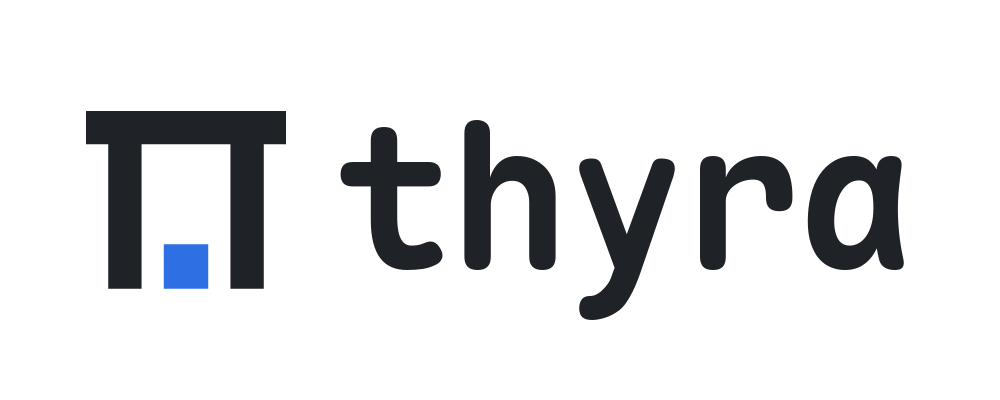
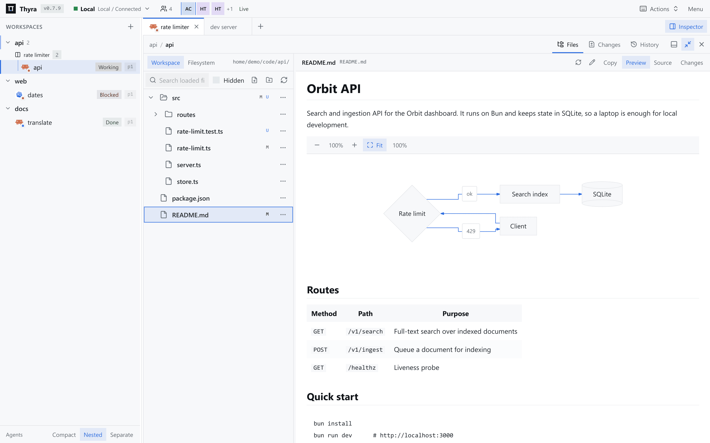
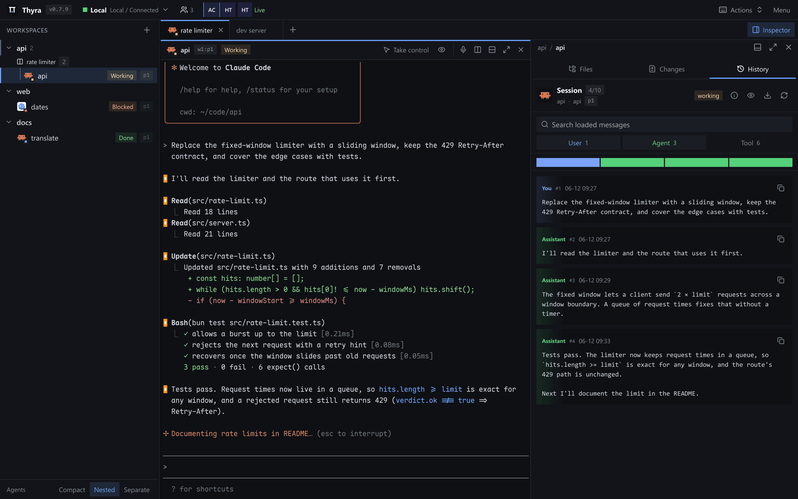
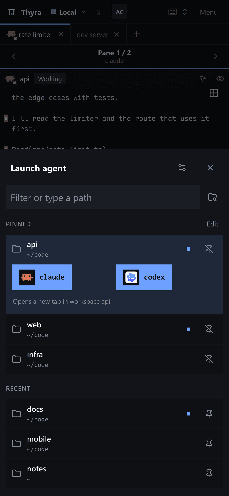
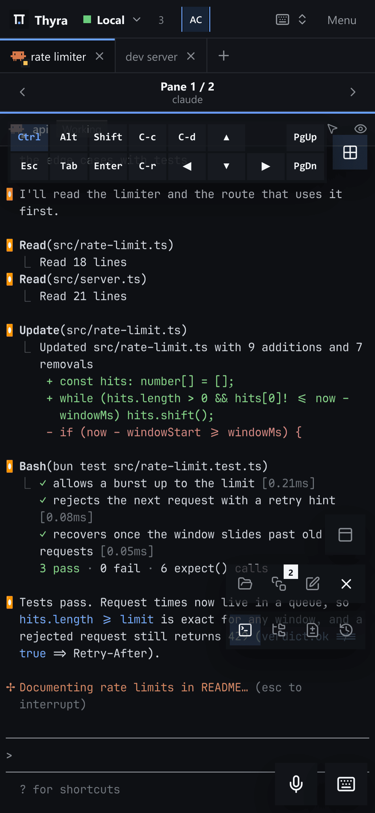
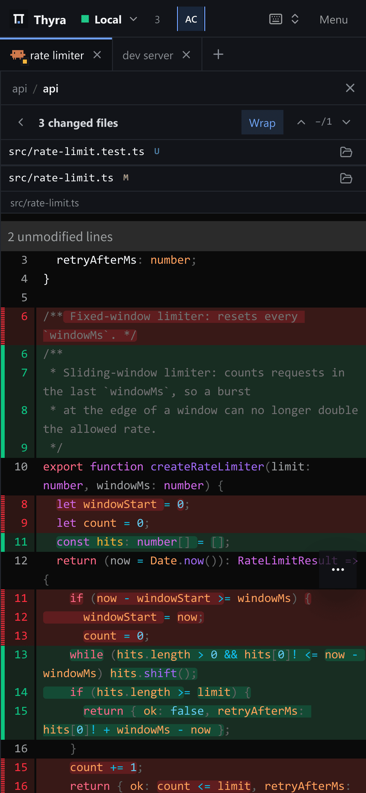

# Thyra

[简体中文](./README.md) | English

<p align="center">
  <picture>
    <source media="(prefers-color-scheme: dark)" srcset="./site/assets/thyra-lockup-on-charcoal.png" />
    
  </picture>
</p>

A **browser client** for [Herdr](https://herdr.dev). Control terminals, inspect
agent sessions, and review files and diffs on desktop or mobile.
Watch an agent on a tablet and type from your phone without resizing it.
**Requires a Herdr server;** the installer sets one up.

## Screenshots

### Desktop

[![Thyra with Claude working in a terminal and the Changes inspector showing a wrapped diff][desktop-changes]][desktop-changes]

Agents and their status in the workspace tree, a live terminal, and the working-tree diff side by side.

<!-- markdownlint-disable MD033 -->

<table width="100%">
  <thead>
    <tr>
      <th width="50%" align="center">File preview (light theme)</th>
      <th width="50%" align="center">Agent history</th>
    </tr>
  </thead>
  <tbody>
    <tr>
      <td width="50%" align="center" valign="top">
        <a href="./docs/images/thyra-desktop-files.png"></a>
      </td>
      <td width="50%" align="center" valign="top">
        <a href="./docs/images/thyra-desktop-history.png"></a>
      </td>
    </tr>
  </tbody>
</table>

### Mobile

<table width="100%">
  <thead>
    <tr>
      <th width="33.33%" align="center">Project launcher</th>
      <th width="33.33%" align="center">Shortcut grid</th>
      <th width="33.33%" align="center">Diff review</th>
    </tr>
  </thead>
  <tbody>
    <tr>
      <td width="33.33%" align="center" valign="top">
        <a href="./docs/images/thyra-mobile-launcher.png"></a>
      </td>
      <td width="33.33%" align="center" valign="top">
        <a href="./docs/images/thyra-mobile-terminal.png"></a>
      </td>
      <td width="33.33%" align="center" valign="top">
        <a href="./docs/images/thyra-mobile-changes.png"></a>
      </td>
    </tr>
  </tbody>
</table>

<!-- markdownlint-enable MD033 -->

Click any screenshot to open the full-resolution image.
The interface is also available in Simplified Chinese; the default [Chinese README](./README.md) shows it.

[desktop-changes]: ./docs/images/thyra-desktop-changes.png

## Quick start

Linux (x86-64, ARM64) and macOS (Apple Silicon, Intel):

```bash
curl -fsSL https://github.com/Yubo-Cao/thyra/releases/latest/download/install.sh | sh
```

Windows 10 1809+ and 11 (x64, ARM64), in PowerShell:

```powershell
irm https://github.com/Yubo-Cao/thyra/releases/latest/download/install.ps1 | iex
```

The installer verifies SHA-256 checksums, installs Thyra and the Herdr server build it pins into your user account without sudo or administrator rights, starts both as user services, and prints the address: `http://127.0.0.1:8787` on the same machine.
It never replaces a Herdr you installed yourself.
Rerun the same command to upgrade; `sh -s -- --uninstall` (or `-Uninstall` on Windows) removes it.
For phones and other computers, publish the loopback address privately with [Tailscale Serve](./docs/TUTORIAL.md#tailscale).
See [deployment](./docs/DEPLOYMENT.md#install-with-the-one-line-installer) for options, manual installs, services, and remote access.

## Install as a PWA

**PWA installation is recommended for daily use:** a separate app window without
browser tabs or the address bar. Open and authenticate with Thyra, then install:

- **iPhone/iPad Safari:** Share -> Add to Home Screen.
- **macOS Safari 17+:** File -> Add to Dock.
- **Chrome/Edge:** browser menu -> Install app.

The process must stay running and reachable. **PWA mode is not offline access.**

## Documentation

- [Website](https://thyra.yubo.fun/) and
  [hands-on tutorial](https://thyra.yubo.fun/tutorial/)
  ([Markdown](./docs/TUTORIAL.md)): local work, mobile, and private remote access.
- [Features and shortcuts](./FEATURES.md)
- [Deployment](./docs/DEPLOYMENT.md): installation, configuration, services, builds.
- [MCP server](./docs/DEPLOYMENT.md#mcp-server): read-only workspace access for Claude Code, Codex, and other agents.
- [Architecture](./docs/ARCHITECTURE.md): system contracts.
- [Security](./SECURITY.md) and [contributing](./CONTRIBUTING.md).

## Development

Use Bun 1.4.1 or newer and a running Herdr server:

```bash
bun install --frozen-lockfile
# Run in separate terminals:
bun run dev:server
bun run dev:web
```

Open <http://localhost:5173>. See [CONTRIBUTING.md](./CONTRIBUTING.md) for checks
and pull requests.

## Security

Thyra controls terminals and modifies real files. Keep the default loopback
binding; read [SECURITY.md](./SECURITY.md) before allowing another device access.
Tailnet users log in automatically as admins, everyone else with a passkey, and workspaces are shared as viewer, editor or owner ([accounts and login](./docs/DEPLOYMENT.md#accounts-and-login)).
Guests without an account can watch one workspace or pane through an expiring, revocable read-only link ([read-only share links](./docs/DEPLOYMENT.md#read-only-share-links)).
Behind a public Cloudflare Tunnel address, tailnet devices are signed in automatically by their Tailscale identity ([tailnet sign-in](./docs/DEPLOYMENT.md#tailnet-sign-in-on-the-public-address)).
Optional email, GitHub and Google sign-in is invite-only by default, and owners invite people by email from **Share workspace** ([sign-in providers](./docs/DEPLOYMENT.md#sign-in-providers)).

## License

Code: [MIT](./LICENSE). Thyra began as a fork of Roamgate by Arthur; the original copyright notice is kept in the license.
Bundled fonts and brand assets retain their original terms; see [THIRD_PARTY_NOTICES.md](./THIRD_PARTY_NOTICES.md).
