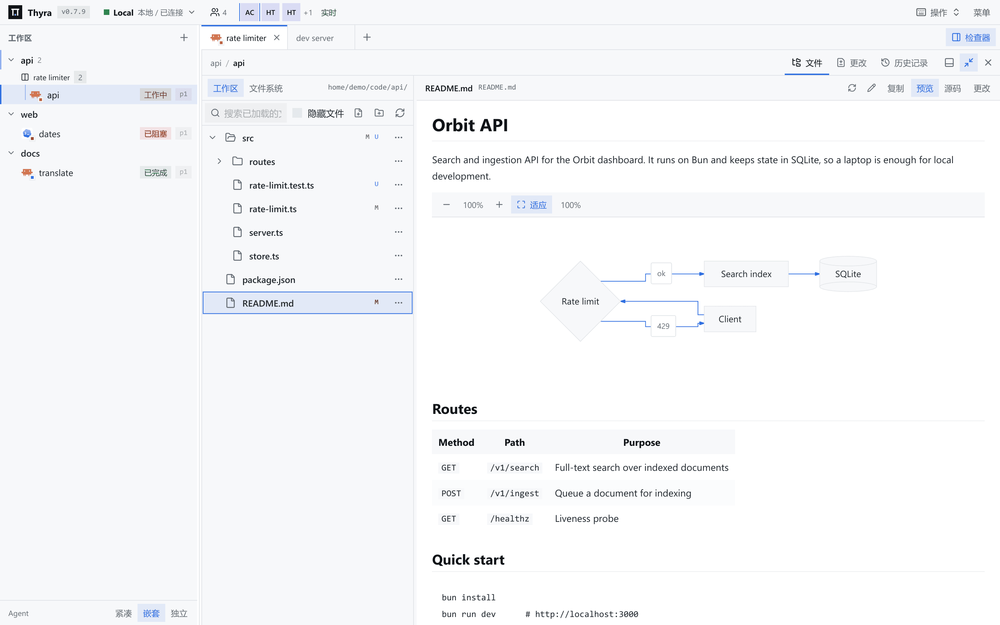
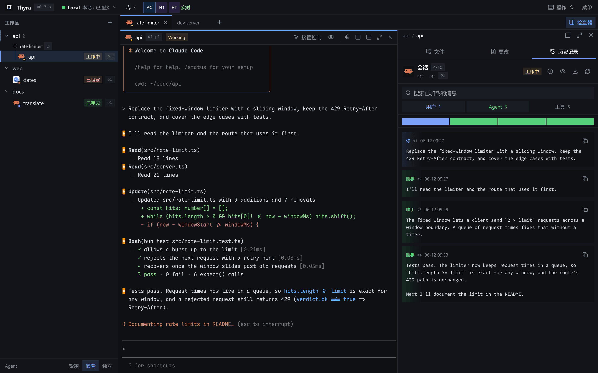
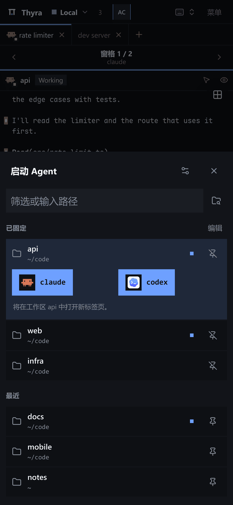
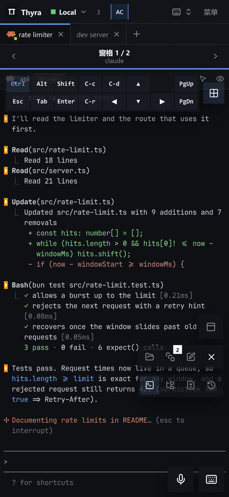
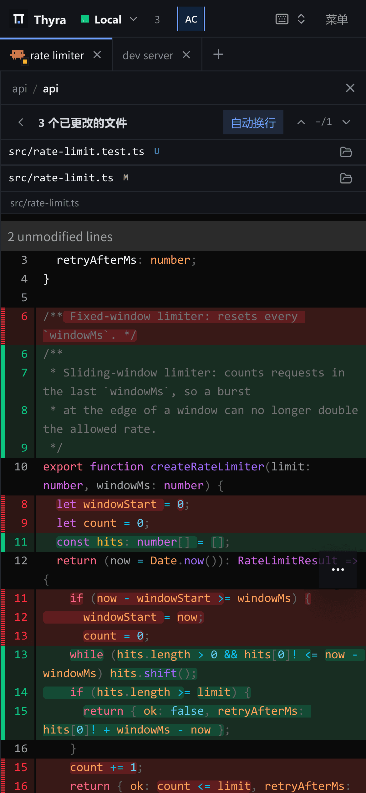

# Thyra

简体中文 | [English](./README.en.md)

<p align="center">
  <picture>
    <source media="(prefers-color-scheme: dark)" srcset="./site/assets/thyra-lockup-on-charcoal.png" />
    
  </picture>
</p>

[Herdr](https://herdr.dev) 的**浏览器客户端**。
在电脑或手机上操作终端、查看 Agent 会话、审阅文件和 diff。
可以在平板上看着 Agent，用手机输入，而不改变终端尺寸。
**需要 Herdr 服务端；** 安装脚本会一并装好。

## 截图

### 桌面端

[![Thyra 界面：Claude 在终端中工作，右侧检查器的“更改”页显示自动换行的 diff][desktop-changes]][desktop-changes]

工作区树里能看到每个 Agent 的状态，实时终端和工作区 diff 并排显示。

<!-- markdownlint-disable MD033 -->

<table width="100%">
  <thead>
    <tr>
      <th width="50%" align="center">文件预览（浅色主题）</th>
      <th width="50%" align="center">Agent 历史记录</th>
    </tr>
  </thead>
  <tbody>
    <tr>
      <td width="50%" align="center" valign="top">
        <a href="./docs/images/thyra-desktop-files-zh.png"></a>
      </td>
      <td width="50%" align="center" valign="top">
        <a href="./docs/images/thyra-desktop-history-zh.png"></a>
      </td>
    </tr>
  </tbody>
</table>

### 移动端

<table width="100%">
  <thead>
    <tr>
      <th width="33.33%" align="center">项目启动器</th>
      <th width="33.33%" align="center">快捷键面板</th>
      <th width="33.33%" align="center">审阅 diff</th>
    </tr>
  </thead>
  <tbody>
    <tr>
      <td width="33.33%" align="center" valign="top">
        <a href="./docs/images/thyra-mobile-launcher-zh.png"></a>
      </td>
      <td width="33.33%" align="center" valign="top">
        <a href="./docs/images/thyra-mobile-terminal-zh.png"></a>
      </td>
      <td width="33.33%" align="center" valign="top">
        <a href="./docs/images/thyra-mobile-changes-zh.png"></a>
      </td>
    </tr>
  </tbody>
</table>

<!-- markdownlint-enable MD033 -->

点击截图可查看原图。界面语言默认跟随浏览器，也可在“设置 > 外观 > 语言”中切换。

[desktop-changes]: ./docs/images/thyra-desktop-changes-zh.png

## 快速开始

Linux（x86-64、ARM64）和 macOS（Apple Silicon、Intel）：

```bash
curl -fsSL https://github.com/Yubo-Cao/thyra/releases/latest/download/install.sh | sh
```

Windows 10 1809+ 和 11（x64、ARM64），在 PowerShell 中运行：

```powershell
irm https://github.com/Yubo-Cao/thyra/releases/latest/download/install.ps1 | iex
```

安装脚本会校验 SHA-256，把 Thyra 和它锁定版本的 Herdr 服务端装到当前用户目录下（不需要 sudo 或管理员权限），以用户服务的形式启动两者，最后打印访问地址：本机为 `http://127.0.0.1:8787`。
它不会替换你自己安装的 Herdr。
重新运行同一条命令即可升级；`sh -s -- --uninstall`（Windows 上为 `-Uninstall`）可卸载。
要从手机或其他电脑访问，请用 [Tailscale Serve](./docs/TUTORIAL.md#tailscale) 私密地发布这个本机地址。
安装选项、手动安装、服务和远程访问见[部署文档](./docs/DEPLOYMENT.md#install-with-the-one-line-installer)。

## 安装为 PWA

**日常使用推荐安装为 PWA：** 独立的应用窗口，没有浏览器标签页和地址栏。先打开 Thyra 并完成登录，然后：

- **iPhone/iPad Safari：** 分享 -> 添加到主屏幕。
- **macOS Safari 17+：** 文件 -> 添加到程序坞。
- **Chrome/Edge：** 浏览器菜单 -> 安装应用。

Thyra 进程必须保持运行且可以访问。**PWA 模式不提供离线访问。**

## 文档

以下文档目前只有英文版：

- [网站](https://thyra.yubo.fun/)和[上手教程](https://thyra.yubo.fun/tutorial/)（[Markdown](./docs/TUTORIAL.md)）：本机使用、手机访问和私密远程访问。
- [功能与快捷键](./FEATURES.md)
- [部署](./docs/DEPLOYMENT.md)：安装、配置、服务和构建。
- [MCP 服务](./docs/DEPLOYMENT.md#mcp-server)：为 Claude Code、Codex 等智能体提供只读的工作区访问。
- [架构](./docs/ARCHITECTURE.md)：系统约定。
- [安全](./SECURITY.md)和[贡献指南](./CONTRIBUTING.md)。

## 开发

需要 Bun 1.4.1 或更新版本，以及一个正在运行的 Herdr 服务端：

```bash
bun install --frozen-lockfile
# 在不同的终端中分别运行：
bun run dev:server
bun run dev:web
```

打开 <http://localhost:5173>。检查项和 PR 流程见 [CONTRIBUTING.md](./CONTRIBUTING.md)。

## 安全

Thyra 能控制终端，也会修改真实文件。请保持默认的仅本机（loopback）监听；允许其他设备访问前，请先阅读 [SECURITY.md](./SECURITY.md)。
tailnet 用户自动以管理员身份登录，其他人使用通行密钥登录，工作区可按查看者、编辑者或所有者共享（见[账户与登录](./docs/DEPLOYMENT.md#accounts-and-login)）。

## 许可证

代码采用 [MIT](./LICENSE) 许可证。Thyra 最初 fork 自 Arthur 的 Roamgate，许可证中保留了原版权声明。
内置字体和品牌素材沿用各自的原始条款，见 [THIRD_PARTY_NOTICES.md](./THIRD_PARTY_NOTICES.md)。
