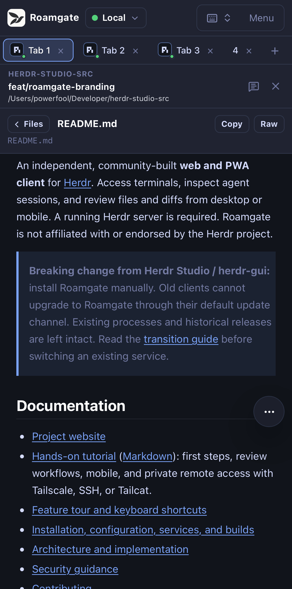

# Thyra

<p align="center">
  <picture>
    <source media="(prefers-color-scheme: dark)" srcset="./site/assets/thyra-lockup-on-charcoal.png" />
    
  </picture>
</p>

A **browser client** for [Herdr](https://herdr.dev). Control terminals, inspect
agent sessions, and review files and diffs on desktop or mobile.
**Requires a running Herdr server.**

## Screenshots

### Desktop

[![Desktop workspace with live terminals and image changes][desktop-changes]][desktop-changes]

Workspace terminals with changed files and image previews.

<!-- markdownlint-disable MD033 -->

<table width="100%">
  <thead>
    <tr>
      <th align="center">File explorer</th>
    </tr>
  </thead>
  <tbody>
    <tr>
      <td align="center" valign="top">
        <a href="./docs/images/thyra-desktop-files.png"></a>
      </td>
    </tr>
  </tbody>
</table>

### Mobile

<table width="100%">
  <thead>
    <tr>
      <th width="33.33%" align="center">Changed files</th>
      <th width="33.33%" align="center">Full terminal control</th>
      <th width="33.33%" align="center">File viewer</th>
    </tr>
  </thead>
  <tbody>
    <tr>
      <td width="33.33%" align="center" valign="top">
        <a href="./docs/images/thyra-mobile-changes.png"></a>
      </td>
      <td width="33.33%" align="center" valign="top">
        <a href="./docs/images/thyra-mobile-terminal.png"></a>
      </td>
      <td width="33.33%" align="center" valign="top">
        <a href="./docs/images/thyra-mobile-files.png"></a>
      </td>
    </tr>
  </tbody>
</table>

<!-- markdownlint-enable MD033 -->

Click any screenshot to open the full-resolution image.

[desktop-changes]: ./docs/images/thyra-desktop-changes.png

## Quick start

1. Install and start [Herdr](https://herdr.dev), or let Thyra install and
   start it later with `thyra herdr setup`.
2. On Linux or macOS, install Thyra:

   ```bash
   # Empty selects latest; use X.Y.Z (no v prefix) to pin a Thyra version.
   curl -fsSL \
     https://github.com/Yubo-Cao/thyra/releases/latest/download/install-thyra.sh \
     | THYRA_VERSION= sh
   ```

   On Windows, download the matching x64 or ARM64 archive from the
   [latest release](https://github.com/Yubo-Cao/thyra/releases/latest).
3. On Linux/macOS, add `~/.local/bin` to `PATH` and run `thyra`.
   On Windows, extract the archive and run `thyra.exe`. Open the printed URL.

See [deployment](./docs/DEPLOYMENT.md) for checksums, configuration, updates,
and services.

## Install as a PWA

**PWA installation is recommended for daily use:** a separate app window without
browser tabs or the address bar. Open and authenticate with Thyra, then install:

- **iPhone/iPad Safari:** Share -> Add to Home Screen.
- **macOS Safari 17+:** File -> Add to Dock.
- **Chrome/Edge:** browser menu -> Install app.

The process must stay running and reachable. **PWA mode is not offline access.**

## Documentation

- [Website](https://thyra.yubo.fun/) and
  [hands-on tutorial](https://thyra.yubo.fun/tutorial/)
  ([Markdown](./docs/TUTORIAL.md)): local work, mobile, and private remote access.
- [Features and shortcuts](./FEATURES.md)
- [Deployment](./docs/DEPLOYMENT.md): installation, configuration, services, builds.
- [Architecture](./docs/ARCHITECTURE.md): system contracts.
- [Security](./SECURITY.md) and [contributing](./CONTRIBUTING.md).

## Development

Use Bun 1.4.1 or newer and a running Herdr server:

```bash
bun install --frozen-lockfile
# Run in separate terminals:
bun run dev:server
bun run dev:web
```

Open <http://localhost:5173>. See [CONTRIBUTING.md](./CONTRIBUTING.md) for checks
and pull requests.

## Security

Thyra controls terminals and modifies real files. Keep the default loopback
binding; read [SECURITY.md](./SECURITY.md) before allowing another device access.

## License

Code: [MIT](./LICENSE). Thyra began as a fork of Roamgate by Arthur; the original copyright notice is kept in the license.
Bundled fonts and brand assets retain their original terms; see [THIRD_PARTY_NOTICES.md](./THIRD_PARTY_NOTICES.md).
