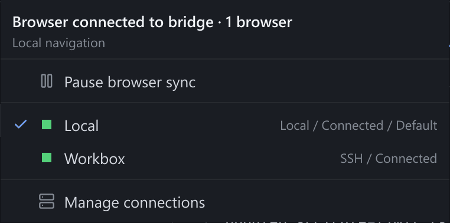

# Installation and Deployment

Configuration reference for Thyra. For a guided workflow and private remote
access, use the [tutorial](./TUTORIAL.md#networking).

## Requirements

- A running Herdr server, or [managed local setup](#managed-herdr-setup).
- Default Unix sockets: `~/.config/herdr/herdr.sock` and
  `~/.config/herdr/herdr-client.sock`; Windows uses corresponding named pipes
  under `%APPDATA%\herdr\`.
- [Bun](https://bun.sh) 1.4.1+ for source builds only; standalone needs no Bun/Node.js.

### Herdr compatibility

This source build supports verified legacy protocols 14–20 (Herdr 0.7.0–0.8.2)
and **Herdr 0.9.x / protocol 22**; the installers and `thyra herdr setup` install the
[pinned build](#managed-herdr-setup). Protocol 21 and unknown versions are
rejected at control/binary probes. Use a compatible Thyra build or separate
server; **do not downgrade a live server**. Published binaries follow their
[release notes](https://github.com/Yubo-Cao/thyra/releases).
The [plugin](#herdr-plugin) separately requires Herdr 0.7.2+.

Herdr 0.9.0 uses stable endpoint generation 1, distinct from protocol 22.
`THYRA_DISABLE_ENDPOINT=1` explicitly selects legacy direct-terminal fallback.

| Area | Behavior / limitation |
| --- | --- |
| Attachment | Endpoints crop the server-rendered tab per pane. Unknown codecs/generations or missing required `pane.focus` fail without silent fallback. Legacy fallback uses takeover and may disconnect another owner. |
| Optional methods | Creation/history controls require advertised methods; unavailable controls explain why. Input, mouse, paste, resize, and rendering can work without optional history. |
| Navigation | Endpoint workspace/tab selection is browser-local across reconnects, not reload/runtime replacement. Same-tab pane focus, topology, and terminal sizes remain shared; size follows Herdr's last-interacting client. Legacy uses shared navigation. |
| Creation | Requires a connected source terminal, except first-workspace bootstrap. Preserves `terminal.new_cwd` (`follow`, `home`, `current`, fixed path); explicit cwd wins. Shared pane focus means `follow` is not browser-isolated. |
| Input | Pixel mouse and enhanced Kitty keyboard / modifyOtherKeys parity are unsupported; legacy keyboard-mode messages are decoded but not applied in-browser. |
| Input from a non-displaying device | Keeping Herdr's size owner while another device [displays the pane](./ARCHITECTURE.md#display-owner-and-input-owner) needs a Herdr build advertising the `input_geometry` endpoint capability. Without it, such input makes Thyra's shell Herdr's size owner, which matters only when a native Herdr TUI views the same tab; Thyra's own resize rules apply either way. |

**OSC 52 clipboard writes:** only the browser with input in the last 30 seconds
matching the receiving endpoint session receives them, never passive viewers.
Input counts whether typed into the terminal or sent through pane RPCs
(composer, paste, keys) for a pane that browser is viewing.
Herdr supplies no producing-pane/input identity: a delayed write from A after B
becomes foreground can reach B's recent input owner. This is not source-PTY or
original-browser isolation. Detach/replacement/disposal invalidates ownership.
Reads are disabled; permission failures show copy-retry UI. Ordinary copy/paste
is unchanged. OSC 52 is unavailable on the **0.9.0 legacy fallback**; older
servers retain their existing relay.

Closing one workspace never implicitly closes its linked group. If Herdr requires
that, inspect all linked workspaces before explicitly running:

```bash
herdr --session <name> workspace close <workspace_id> --group
```

See [endpoint contracts](./ARCHITECTURE.md#terminal-endpoints) and
[creation/timeouts](./ARCHITECTURE.md#browser-navigation-and-creation).

## Install with the one-line installer

Releases publish Linux/macOS/Windows x86-64 and ARM64 archives, the installers, and `herdr-release.json`, the Herdr build that release pins.
Unpublished versions require a [source build](#build-a-standalone-executable).

```bash
# Linux and macOS
curl -fsSL https://github.com/Yubo-Cao/thyra/releases/latest/download/install.sh | sh
```

```powershell
# Windows 10 1809+ and 11, in PowerShell
irm https://github.com/Yubo-Cao/thyra/releases/latest/download/install.ps1 | iex
```

The installers are served by GitHub over HTTPS from the latest release, so the URL is stable and always matches the newest archives; `releases/download/vX.Y.Z/install.sh` installs a fixed version.
Each run:

1. Detects the platform (an x86-64 shell under Rosetta still gets the Apple Silicon build) and downloads `thyra-<platform>.tar.xz` (`.zip` on Windows) plus its `.sha256`, rejecting a mismatch before anything is installed.
2. Downloads the Herdr build named in `herdr-release.json` (repository, tag, and per-target SHA-256) from that Herdr GitHub release and verifies it against the pin.
   Windows ARM64 uses Herdr's x86-64 build under emulation, as Herdr's own installer does.
3. Installs the binaries atomically, keeping `thyra.previous` and `herdr.previous`.
4. Creates the service config if missing, runs `thyra herdr setup` (which starts Herdr only when no Herdr server answers), and runs `thyra service install`, which restarts Thyra.
5. Waits for `/healthz` and prints the address and next steps.

| Platform | Thyra | Herdr | Services |
| --- | --- | --- | --- |
| Linux | `~/.local/bin/thyra` | `~/.local/bin/herdr` | systemd user units `thyra.service`, `thyra-herdr.service` |
| macOS | `~/.local/bin/thyra` | `~/.local/bin/herdr` | LaunchAgents `dev.thyra`, `dev.thyra.herdr` |
| Windows | `%LOCALAPPDATA%\Programs\Thyra\thyra.exe` (added to the user PATH, with a `herdr.cmd` shim) | `%APPDATA%\thyra\herdr\<tag>\herdr.exe` | Per-user scheduled tasks `dev.thyra-<key>`, `dev.thyra.herdr-<key>` |

**Herdr ownership.**
The installer records the Herdr it installed (`~/.config/thyra/installer-herdr.sha256`, or `%APPDATA%\thyra\installer-herdr.txt`).
It never replaces or removes a Herdr it did not install, including one elsewhere on `PATH`; it keeps using that Herdr and says so.
Pass `--replace-herdr` (`-ReplaceHerdr`) to install the pinned build anyway; the old binary is kept as `herdr.previous`.
Thyra works with stock Herdr 0.9.x (protocol 22), but the pinned build is the [Herdr fork](https://github.com/Yubo-Cao/herdr) that adds collaboration leases, live handoff, and agent memory limits; with stock Herdr, collaboration falls back to bridge-local mode.
Do not run `herdr update` on the pinned build: it installs stock Herdr from herdr.dev; rerun the Thyra installer instead.

**Upgrades** rerun the same command.
Thyra restarts immediately.
A running Herdr server is never restarted, because that ends its panes: it keeps the previous build until you restart it (`systemctl --user restart thyra-herdr.service`, `launchctl kickstart -k gui/$(id -u)/dev.thyra.herdr`, or `thyra herdr uninstall` then `thyra herdr setup` on Windows).
With the pinned Herdr fork, `herdr server live-handoff --import-exe ~/.local/bin/herdr` moves the panes to the new build without restarting them; on macOS the LaunchAgent keeps supervising the replacement (see [launchd supervision](#keep-a-launchd-herdr-server-supervised-across-live-handoffs)).

| Option (`sh -s -- ...`) | PowerShell | Environment | Behavior |
| --- | --- | --- | --- |
| `--version X.Y.Z` | `-Version X.Y.Z` | `THYRA_VERSION` | Install that release instead of the latest |
| `--port N` | `-Port N` | `THYRA_PORT` | Port for the service config (default 8787) |
| `--lan` | `-Lan` | | Bind `0.0.0.0`; browsers log in with [passkeys](#accounts-and-login) |
| `--local` | | | Bind `127.0.0.1` (the default for new configs) |
| `--no-service` | `-NoService` | `THYRA_NO_SERVICE=1` | Install binaries only |
| `--no-herdr` | `-NoHerdr` | `THYRA_NO_HERDR=1` | Leave Herdr alone |
| `--replace-herdr` | `-ReplaceHerdr` | | Replace a Herdr the installer did not install |
| `--uninstall [--purge]` | `-Uninstall [-Purge]` | | Remove services and binaries; `--purge` also deletes Thyra's config |
| | | `THYRA_INSTALL_DIR` | Binary directory |
| | | `THYRA_INSTALL_BASE_URL` | Flat mirror of the Thyra release assets |
| | | `THYRA_HERDR_BASE_URL` | Flat mirror of the pinned Herdr assets |

`irm | iex` cannot pass parameters; set the environment variables first, or run `& ([scriptblock]::Create((irm <url>/install.ps1))) -Uninstall`.
Mirrors require HTTPS except loopback testing; URLs cannot contain credentials, queries, or fragments.
To test a build locally, serve `dist/` plus `scripts/install.sh`, `scripts/install.ps1`, and a pin written by `bun scripts/pin-herdr.ts mirror <herdr-assets-dir>` with `python3 -m http.server --bind 127.0.0.1`, and point `THYRA_INSTALL_BASE_URL` and `THYRA_HERDR_BASE_URL` at it.

**Where services are unavailable** (WSL without systemd, containers, SSH sessions without a user manager), the installer installs the binaries and prints how to run `herdr server` and `thyra` yourself.
On Linux, `sudo loginctl enable-linger "$USER"` keeps user services running after logout.

**Uninstall** with `curl -fsSL .../install.sh | sh -s -- --uninstall`.
It runs `thyra service uninstall` and `thyra herdr uninstall` (both remove only definitions Thyra generated), deletes Thyra and the Herdr it installed, and keeps `~/.config/thyra` (accounts, connection profiles, settings) unless `--purge` is given.
Herdr's own data (`~/.config/herdr`, `%APPDATA%\herdr`) is never touched.

**Windows notes.**
Herdr's Windows build is a beta from the Herdr project.
Thyra on Windows attaches only to local Herdr named pipes; SSH connection profiles need a Linux or macOS bridge, so for a remote or WSL Herdr, run Thyra there (for example with the Linux installer inside WSL) and open it from Windows.
Scheduled tasks start at logon; allow Private networks only if Windows Firewall prompts and you use `-Lan`.

### Install manually

Download `thyra-<platform>.tar.xz` (or the Windows `.zip`) and its `.sha256` from the [latest release](https://github.com/Yubo-Cao/thyra/releases/latest), verify with `sha256sum -c`, `shasum -a 256 -c`, or `Get-FileHash`, extract, and put `thyra` on `PATH`.
Install Herdr yourself, or let `thyra herdr setup` download the pinned build.
Then run `thyra`, or `thyra service install` for a user service.

### Remote access and security

New installer configs bind `127.0.0.1`: only the same machine can connect, and direct local requests need no login.
For phones and other computers, keep that binding and publish it privately with `tailscale serve --bg --https=443 http://127.0.0.1:8787`, and set `THYRA_PUBLIC_BASE_URL` to the HTTPS address; tailnet users are then logged in by Tailscale identity ([tutorial](./TUTORIAL.md#tailscale), [reverse proxies](#reverse-proxies-and-allowed-origins)).
To use Thyra from another computer over SSH, forward the port: `ssh -L 8787:127.0.0.1:8787 host`.
`--lan` binds all interfaces, and every browser must log in with a [passkey](#accounts-and-login), which needs [native HTTPS](#native-https) or an HTTPS proxy; use it only on trusted networks.
Never expose Thyra directly to the public internet, and never use `tailscale funnel` for it; Thyra runs shell commands with your user's rights.
Read [Security](../SECURITY.md) before allowing another device access.

## Managed Herdr setup

```bash
thyra herdr setup
thyra herdr status
thyra herdr uninstall
```

If absent, setup downloads the Herdr build pinned in [`server/src/herdr/herdr-release.json`](../server/src/herdr/herdr-release.json) (the same pin the installers use), verifies its SHA-256, and installs it to `~/.local/bin/herdr` on Unix or `%APPDATA%\thyra\herdr\<tag>` on Windows.
It never replaces a binary it did not install.
If a Herdr binary already exists, it uses the first one on PATH or in those locations and leaves it in place.

Setup installs and starts `herdr server` as a user service: `thyra-herdr.service` (Linux), `dev.thyra.herdr` (macOS), or a per-user Windows scheduled task.
It does nothing when a Herdr server already answers on the default socket, with one exception on macOS: when the `dev.thyra.herdr` job is not loaded, the running server supports live handoff, and the Herdr binary supports `herdr server --adopt`, `thyra herdr setup` loads the job and waits until it has adopted the running server through a live handoff, so the panes keep running under launchd.
Otherwise it reports why the running server stays unsupervised.
Definitions carry a Thyra marker; unrelated existing definitions are untouched.
The web UI offers the same confirmed **Set up Herdr / Start Herdr** action when the default local server is unreachable, with visible failures and retry.

Only default local configuration is supported.
SSH profiles/`--ssh-host`, named sessions, and explicit control/render socket flags or environment variables are refused; start Herdr yourself for those configurations.

`thyra herdr uninstall` stops and removes only the service definition that setup generated, which ends that server's panes; it keeps the Herdr binary and Herdr's data.
Remove an installed binary only if unwanted and owned by this setup; never delete the shared `~/.local/bin` directory.

## Herdr plugin

Requires Herdr 0.7.2+ and Bun for the shim. The plugin ID is `thyra`.
Thyra never edits Herdr's plugin registry.

For an **unreleased checkout**, build before linking (existing binaries are not
validated). Keep the checkout and rebuild after updates:

```bash
git clone https://github.com/Yubo-Cao/thyra.git
cd thyra
bun scripts/thyra-plugin.ts build-source
herdr plugin link .
```

`build-source` installs workspace dependencies and builds `server/thyra`
(`thyra.exe` on Windows). Linking after success skips release download;
neither step starts the service.

For a **published release**, replace `X.Y.Z` with its version:

```bash
herdr plugin install Yubo-Cao/thyra --ref vX.Y.Z
```

The manifest downloads/checksum-verifies that version's binary. Failure never
falls back to compilation; unpublished versions cannot use this path.

Plugin actions manage the same [user service](#run-as-a-user-service):

```bash
herdr plugin action invoke thyra.start      # install/start
herdr plugin action invoke thyra.url        # browser URL
herdr plugin action invoke thyra.status
herdr plugin action invoke thyra.restart
herdr plugin action invoke thyra.uninstall  # remove service, retain data
```

Actions are asynchronous. Inspect `herdr plugin log list --plugin thyra` or
open `herdr plugin pane open --plugin thyra --entrypoint panel` for status,
URL, version, and start/restart/uninstall controls. Default is a session-modal
popup; `--placement split`, `tab`, `zoomed`, or `overlay` creates a regular pane
visible to other Herdr clients.

## MCP server

Thyra can give MCP-capable agents (Claude Code, Codex, and others) a **read-only** view of your workspaces: workspaces, tabs, and panes with agent status and viewers; recent pane output; agent session history and search; Git status and diffs; files inside workspace checkouts; and current activity.
No MCP tool can type into a terminal, run commands, or change files.
The [architecture notes](./ARCHITECTURE.md#mcp) describe the guarantees.

Create a token for each agent; the token is printed once and stored only as a digest in `~/.config/thyra/mcp-tokens.json`:

```bash
thyra mcp token create --name claude --scope all       # every workspace
thyra mcp token create --name bot --scope w1,w3        # only these workspaces
thyra mcp token list
thyra mcp token revoke claude                          # takes effect immediately
```

Workspace ids come from `herdr workspace list` or the MCP `list_workspaces` tool; `<connection-id>/w1` scopes a workspace on a non-default connection.
Run these commands as the user that runs the Thyra service.

**Local agents (stdio).** `thyra mcp` speaks MCP on stdin/stdout and forwards to the running Thyra at `http://127.0.0.1:$PORT/mcp` (`THYRA_MCP_URL` or `--url` overrides it):

```bash
claude mcp add thyra -e THYRA_MCP_TOKEN=<token> -- thyra mcp
codex mcp add thyra --env THYRA_MCP_TOKEN=<token> -- thyra mcp
```

**Remote agents (Streamable HTTP).** Point the agent at `/mcp` on the Thyra URL with an `Authorization: Bearer <token>` header; the login cookie is never accepted there:

```bash
claude mcp add --transport http thyra https://thyra.example.ts.net/mcp --header "Authorization: Bearer <token>"
codex mcp add thyra --url https://thyra.example.ts.net/mcp --bearer-token-env-var THYRA_MCP_TOKEN
```

Keep the same [remote access](#remote-access-and-security) rules as for the browser: publish `/mcp` only on loopback, a tailnet, or TLS.
Every result is secret-redacted, and secret files (`.env*`, `*.pem`, `*.key`, `id_*`, credential files, `.ssh`, `.aws`, `.git`, and others) are denied.
Optional `~/.config/thyra/mcp.json` adds deny patterns and sets the per-token rate limit (default 120 requests per minute); `THYRA_MCP_DENY_FILES` adds comma-separated patterns; restart Thyra after changing either:

```json
{ "deny_files": ["*.sqlite", "private"], "rate_limit_per_minute": 60 }
```

Each call is logged to `~/.config/thyra/mcp-audit.jsonl` (token, tool, redacted arguments, outcome, duration), with one rotated `.1` file.

## Shell integration

Run `thyra shell-integration install --shell all` on the host running both Thyra
and the shells. Use `--shell bash`, `zsh`, or `fish` to select one installed shell.
The installer backs up existing rc files before their first modification and
adds a guarded, marked source block. Open a new interactive shell in a Herdr
pane to activate it. `thyra shell-integration status` reports installation and
verified live pane state; `thyra shell-integration uninstall` removes the blocks.

Scripts live under `${XDG_DATA_HOME:-~/.local/share}/thyra/shell-integration/`.
Server startup refreshes those scripts without changing rc files. Private state
files use `${XDG_RUNTIME_DIR:-/tmp/thyra-$UID}/thyra/shell/`; command history uses
`${XDG_STATE_HOME:-~/.local/state}/thyra/shell-history.jsonl` and
`shell-history.sqlite`. Commands beginning with a space are excluded from the
history spool. The [shell RPC contract](ARCHITECTURE.md#shell-input-service)
requires the pane's input-writer permission, including for history reads.

Existing SSH profiles tunnel Herdr sockets and do not transport this service;
shell input is unavailable through those profiles. Run Thyra on the shell host
to use the service there. The integration does not propagate into nested SSH
shells.

## Basic runtime configuration

Flags override environment variables, then defaults; `thyra --help` lists all
options. Standalone ignores cwd `.env`/`bunfig.toml`: export variables, pass flags,
or edit the service environment file. Source `bun run` retains normal Bun loading.

| Flag | Environment variable | Default |
| --- | --- | --- |
| `--host <addr>` | `HOST` | `127.0.0.1` |
| `--port <n>` | `PORT` | `8787` |
| `--tls-cert <path>` | `THYRA_TLS_CERT` | Disabled; PEM chain, requires key |
| `--tls-key <path>` | `THYRA_TLS_KEY` | Disabled; PEM key, requires certificate |
| `--socket-path <path>` | `HERDR_SOCKET_PATH` | Default control socket/pipe |
| `--client-socket-path <path>` | `HERDR_CLIENT_SOCKET_PATH` | Default render socket/pipe |
| `--ssh-host <user@host>` | `HERDR_SSH_HOST` | Disabled; Linux/macOS only |
| `--session <name>` | `HERDR_SESSION` | Default session |
| `--public-dir <path>` | `PUBLIC_DIR` | Embedded assets |
| `--log-level <level>` | `THYRA_LOG_LEVEL` | `info` |
| `--open` | `OPEN_BROWSER=1` | Disabled |

| Additional environment variable | Purpose |
| --- | --- |
| `THYRA_UPDATE_BASE_URL` | Latest-release mirror directory |
| `THYRA_DISABLE_UPDATE_CHECK=1` | Disable update checks |
| `THYRA_RESTART_SUPERVISOR=0\|1` | Override external supervisor detection |
| `THYRA_DISABLE_ENDPOINT=1` | Legacy terminal fallback; see compatibility |
| `THYRA_PUBLIC_BASE_URL` | Comma-separated URLs browsers use through a proxy or DNS name, such as `https://thyra.example.ts.net`; see [reverse proxies](#reverse-proxies-and-allowed-origins) |
| `THYRA_TRUSTED_PROXIES` | Reverse proxies whose forwarded headers are believed; see [reverse proxies](#reverse-proxies-and-allowed-origins) |
| `THYRA_TAILNET_AUTH=admin\|member\|off` | Log in proxied tailnet users by Tailscale `whois`, creating accounts with that role (default `admin` when `whois` is available); see [accounts and login](#accounts-and-login) |
| `THYRA_DB_PATH` | Account database (default `~/.config/thyra/thyra.db`) |
| `THYRA_ASSET_ARCHIVE_DIR` | Fingerprinted files of the last five builds, so tabs opened before an update can still load their chunks (default `~/.config/thyra/asset-archive` for the standalone binary, off for source runs; empty disables) |
| `THYRA_PUBLIC_LISTEN` | Second, internet-facing listener (`127.0.0.1:8788`) for Cloudflare Tunnel; see [public access](#public-access-through-cloudflare-tunnel) |
| `THYRA_PUBLIC_ORIGIN` | The one HTTPS origin served by the public listener, such as `https://thyra.example.com` |
| `THYRA_PUBLIC_TRUSTED_PROXIES` | Peers whose `CF-Connecting-IP` the public listener believes (default `loopback`) |
| `THYRA_RESEND_API_KEY`, `THYRA_EMAIL_FROM` | Email sign-in codes and invitations through Resend; see [sign-in providers](#sign-in-providers) |
| `THYRA_GITHUB_CLIENT_ID`, `THYRA_GITHUB_CLIENT_SECRET` | "Continue with GitHub"; see [sign-in providers](#sign-in-providers) |
| `THYRA_GOOGLE_CLIENT_ID`, `THYRA_GOOGLE_CLIENT_SECRET` | "Continue with Google"; see [sign-in providers](#sign-in-providers) |
| `THYRA_SIGNUP=invite\|open` | Whether unknown verified identities get a member account (default `invite`: they do not) |
| `THYRA_TAILNET_SSO_URL` | HTTPS origin of the tailnet listener (`https://dev.example.com`); tailnet devices then sign in to the public address automatically; see [tailnet sign-in](#tailnet-sign-in-on-the-public-address) |
| `THYRA_TAILSCALE_IDENTITY=off` | Disable Tailscale `whois` lookups |
| `THYRA_TAILSCALE_SOCKET`, `THYRA_TAILSCALE_CLI` | tailscaled LocalAPI socket or `tailscale` binary to use for `whois` |
| `THYRA_IDENTITY_PATH` | Collaborator identity file (default `~/.config/thyra/identities.json`) |

Update mirrors need platform archives, `.sha256` files, and
`thyra-<platform>.update.json` with `name: "thyra"`. Missing or invalid manifests
fail closed without archive discovery. HTTPS is required except loopback tests;
credentials, queries, and fragments in URLs are rejected.

```bash
thyra                              # local, no login for direct local use
thyra --host 0.0.0.0 --port 8787     # every browser logs in with a passkey
```

Read [accounts and login](#accounts-and-login) and [Security](../SECURITY.md) before non-loopback use.

## Accounts and login

Direct local use of a loopback listener needs no login.
Everyone else has an account: tailnet users behind a trusted proxy get one automatically, and others log in with a passkey.
Instance admins manage the host; members see only the workspaces shared with them, as viewer, editor or owner ([roles](../SECURITY.md#what-each-role-may-do)).

```bash
thyra user add yubo --admin --tailscale yubo@github   # instance admin; prints a passkey link
thyra user add alice                                  # member; prints a passkey link
thyra user link alice --email alice@example.com       # a verified address for email sign-in
thyra user enroll alice --base-url https://thyra.example.com  # another link, for another host name
thyra user list
thyra user role alice admin|member
thyra user disable alice | thyra user enable alice
thyra user remove alice
thyra grant alice w3 editor          # owner|editor|viewer|none; w3 on the default connection
thyra grant alice ssh-box/w1 viewer  # a workspace on another connection
thyra grant list w3
thyra session list [alice]
thyra session revoke <session-id> | thyra session revoke --user alice
```

The commands write the account database directly (`~/.config/thyra/thyra.db`, or `THYRA_DB_PATH` from the environment or the service environment file); a running Thyra applies them within a second and disconnects affected browsers.
An enrollment link is single-use, valid for 24 hours, and carries its secret in the URL fragment.
It points at `--base-url`, else the first HTTPS `THYRA_PUBLIC_BASE_URL`, else `http://localhost:$PORT`.
**A passkey belongs to one host name** and works only in a secure context: HTTPS, or `localhost` (an SSH port forward).
Open the link on the device or password manager that keeps the passkey; a logged-in user adds passkeys for the host they are on under **Configuration > Account**, which also lists and signs out login sessions.
Workspace owners share a workspace from its context menu (**Share workspace…**) with existing users, by user name or linked login, or, with email sign-in on, by email address: someone without an account gets a pending member account with that grant and a one-time invitation link (valid 7 days) that signs them in and then links whichever method they choose.

### Sign-in providers

Besides passkeys and tailnet login, Thyra can sign people in by email, GitHub and Google.
Each provider is off until its variables are set; put them in `~/.config/thyra/auth-providers.env` (mode `0600`), which the server reads at startup (a copy readable by others is ignored) and the systemd unit also loads with `EnvironmentFile=-%h/.config/thyra/auth-providers.env`:

```bash
# ~/.config/thyra/auth-providers.env  (chmod 600)
THYRA_RESEND_API_KEY=re_...
THYRA_EMAIL_FROM="Thyra <login@example.com>"
THYRA_GITHUB_CLIENT_ID=...
THYRA_GITHUB_CLIENT_SECRET=...
THYRA_GOOGLE_CLIENT_ID=...
THYRA_GOOGLE_CLIENT_SECRET=...
```

- **Email** (Resend): verify the sending domain of `THYRA_EMAIL_FROM` in Resend (its SPF and DKIM records), then create an API key with sending access.
  The login page asks for an address and mails a 6-digit code and a one-time link, both valid for 10 minutes and usable once; on an iOS Home Screen app, whose mailed links open in Safari, type the code into the app.
  Every address gets the same answer; each address gets at most one message a minute, each client address ten every ten minutes, and five wrong codes end a message.
- **GitHub**: create an OAuth app (GitHub **Settings > Developer settings > OAuth Apps**) with the callback URL `https://thyra.example.com/auth/oauth/github/callback`.
- **Google**: create an OAuth client of type **Web application** in the Google Cloud console with the redirect URI `https://thyra.example.com/auth/oauth/google/callback` and the `openid`, `email` and `profile` scopes.

The callback host is the address people sign in on, normally `THYRA_PUBLIC_ORIGIN`; register one callback per address you use.
Identities are linked by the provider's user id; a new GitHub or Google identity joins an existing account only when a signed-in person links it under **Configuration > Account**, when it arrives through an invitation, or when its address is verified (GitHub's primary verified address, Google's `email_verified`) and matches exactly one account's verified address.
Anyone else who signs in gets "Signed in as … Ask the owner for access" and no account, unless `THYRA_SIGNUP=open` makes them members without grants.
When the provider returns to a browser other than the one that started (an iOS Home Screen app opens it in Safari), that browser shows a 4-digit number and asks before finishing; the app, still polling, then signs in.

**Configuration > Account** edits the display name and picture (cropped and scaled to 256 px in the browser, or imported from a linked GitHub or Google account), adds and removes passkeys, GitHub, Google and email addresses (never the last way to sign in), and lists sessions with their device, method and last activity, one of which or all others can be signed out.

### Read-only share links

For someone without an account, create an anonymous **read-only link** in the same dialog (**Links**) or on the host:

```bash
thyra share create w3                                  # whole workspace, 24 hours
thyra share create w3 --pane w3:p2 --expires 1h --max-uses 1 --label review
thyra share list [w3]
thyra share revoke <link-id>
```

A guest who opens the link sees only that workspace (or pane), may watch the terminals, browse their history (a local copy that moves no one else's view) and read agent status (and, for a whole-workspace link, its files and Git changes), and never types, resizes, takes control or changes anything.
Guests appear to others as "Guest" plus the link's label and can follow them.
The URL is shown once (only a digest is stored); `--expires` takes `30m` to `30d` (default `24h`), and revoking a link or its expiry disconnects its guests within a second.
Links point at `THYRA_PUBLIC_ORIGIN` when the [public listener](#public-access-through-cloudflare-tunnel) is set (`--base-url` overrides it), since guests usually have no tailnet access; they also work on the primary listener.
A browser already signed in (tailnet, passkey or local use) keeps its account and grants: the landing page offers **Open with my account** or **Open as guest**, and only the latter turns it into the guest until it chooses **Leave shared view** in the guest badge.
Anyone who holds the link can watch until then, so share it privately, keep expiry short, and use `--max-uses 1` for one person.

With Tailscale, **tailnet login** needs no passkey: when a proxied request's forwarded client address is a tailnet address and Tailscale `whois` names a user, Thyra logs in that user's account, creating it on first sight and linking the Tailscale login.
New tailnet accounts are instance admins (`THYRA_TAILNET_AUTH=admin`, the default whenever `whois` works, see [collaborator identity](#collaborator-identity)); `THYRA_TAILNET_AUTH=member` makes them members instead, and `off` disables tailnet login.
Restrict the proxy's port with Tailscale ACLs.
Tagged nodes and failed lookups get the login page.
Never enable tailnet login for a proxy that is also reachable from outside the tailnet, such as a public tunnel (`cloudflared`).

**Upgrading from password or token login.**
`THYRA_PASSWORD`, `--password`, `~/.config/thyra/auth-token` and `?token=` links are no longer used, and old session cookies are ignored.
Before upgrading a host that is used only through a proxy or on a non-loopback address, make sure you can still get in: tailnet login through a local proxy, an SSH port forward (`ssh -L 8787:127.0.0.1:8787 host`, then `http://localhost:8787`), or a passkey from `thyra user add <name> --admin`.
Then remove `THYRA_PASSWORD` from the service environment and delete `auth-token`.

### Native HTTPS

Supply both a PEM chain (leaf first) and matching unencrypted private key:

```bash
thyra --host 0.0.0.0 --port 8443 \
  --tls-cert /path/to/cert-chain.pem \
  --tls-key /path/to/private-key.pem
```

Missing/unreadable/malformed/mismatched files stop startup, never fall back to
HTTP. Without TLS settings, HTTP is used. HTTPS adds `Secure` cookies and HTTPS
startup links, and lets browsers use passkeys on a host name, but **does not change
authentication**: direct local use of a loopback listener skips login; everything
else logs in ([accounts and login](#accounts-and-login)). Do not expose directly
to the public internet.

For private LAN testing, use your issuer or [mkcert](https://github.com/FiloSottile/mkcert).
Replace this reserved example IP with the host's actual LAN address:

```bash
mkcert -install
mkcert -cert-file cert.pem -key-file key.pem localhost 127.0.0.1 ::1 192.0.2.10
thyra --host 0.0.0.0 --port 8443 \
  --tls-cert "$PWD/cert.pem" --tls-key "$PWD/key.pem"
```

- SANs must match each client hostname/IP; `localhost` does not cover LAN addresses.
- Every device must trust the issuer. Transfer only mkcert's `rootCA.pem` from
  `mkcert -CAROOT`, **never `rootCA-key.pem`**. On iOS, install the CA profile and
  enable full trust in Settings > General > About > Certificate Trust Settings.
- Bypassing warnings does not enable Service Workers/secure APIs. Verify trusted
  HTTPS before Home Screen installation; remove temporary CA profiles after tests.
- Protect keys and keep them out of Git. Issuance/renewal is external; restart
  after replacement. Services need absolute paths in their environment file.

### Reverse proxies and allowed origins

A browser reaching Thyra through a proxy or a DNS name needs that URL in `THYRA_PUBLIC_BASE_URL`; otherwise Thyra answers `421 misdirected request` (DNS rebinding protection).
IP-literal and loopback addresses (`http://192.0.2.10:8787`, `http://localhost:8787`) work without it.
WebSocket upgrades and state-changing requests must come from that origin, the request's own origin, or `http://localhost:<port>`; see [Security](../SECURITY.md#trust-model).

Forwarded headers (`X-Forwarded-For`, `X-Forwarded-Host`, `X-Forwarded-Proto`, `Forwarded`, `X-Real-IP`) are believed only from `THYRA_TRUSTED_PROXIES`, which defaults to loopback.
A request carrying them is proxied, never local, so it must log in even on a loopback listener.
The proxy must preserve `Host` or send `X-Forwarded-Host`, and should send `X-Forwarded-Proto` for HTTPS (Caddy and `tailscale serve` do all three; nginx needs `proxy_set_header Host $host;`, `X-Forwarded-For $proxy_add_x_forwarded_for`, and `X-Forwarded-Proto $scheme`) and must pass WebSocket upgrades.

```caddyfile
https://thyra.example.com {
	reverse_proxy 127.0.0.1:8787
}
```

```bash
# ~/.config/thyra/thyra.env
HOST=127.0.0.1
PORT=8787
THYRA_PUBLIC_BASE_URL=https://thyra.example.com
```

Each browser, including an installed home-screen app, logs in once, with a passkey or by [tailnet login](#accounts-and-login); the session cookie lasts 30 days and is `Secure` over HTTPS.

Tailnet login (see [accounts and login](#accounts-and-login)) gives every tailnet user who can reach the proxy an account, so restrict the proxy's port with Tailscale ACLs.
Set `THYRA_TAILNET_AUTH=off` if the proxy is also reachable from outside the tailnet; never point a public tunnel such as `cloudflared` at this listener: use the [public listener](#public-access-through-cloudflare-tunnel).

### Public access through Cloudflare Tunnel

Thyra can serve a public address from a second listener while the primary listener stays private (tailnet or loopback).
**The listener, never a request header, decides trust.** Requests on the public listener are always public:

- Only a session in the listener's own `__Host-thyra_session` cookie (from a passkey or [tailnet sign-in](#tailnet-sign-in-on-the-public-address)), or a [share link](#read-only-share-links)'s `__Host-thyra_guest` cookie, authenticates there; tailnet login, direct-local bypass and the primary listener's cookies never do, whatever `X-Forwarded-For`, `CF-Connecting-IP` or Tailscale headers claim.
- Only `THYRA_PUBLIC_ORIGIN` is accepted as `Host` and `Origin` (anything else gets `421` or `403`); `X-Forwarded-*` headers are ignored.
- The client address (login and request rate limits, 300 requests a minute per address) is `CF-Connecting-IP` when the peer is in `THYRA_PUBLIC_TRUSTED_PROXIES` (default `loopback`, the local `cloudflared`), otherwise the peer.
- Responses carry HSTS, a strict Content Security Policy, `nosniff` and `frame-ancestors 'none'`; cookies set there use the `__Host-` prefix.
- Before login it serves only the passkey login and enrollment pages, tailnet sign-in's start, callback and redemption, share-link landing pages (`/s/<id>`) and redemption, their script (`/auth/passkey.js`) and static assets; every other page redirects to login, and every API and WebSocket request gets `401`.
  MCP is never served there.

Cloudflare Tunnel (`cloudflared`) connects outbound, so no inbound port opens.
Create a named tunnel once, as the account owner:

```bash
cloudflared tunnel login                   # browser: authorize the zone (writes ~/.cloudflared/cert.pem)
cloudflared tunnel create thyra            # writes ~/.cloudflared/<TUNNEL_ID>.json
cloudflared tunnel route dns thyra thyra.example.com   # CNAME -> <TUNNEL_ID>.cfargotunnel.com
```

`tunnel route dns` needs the certificate of the zone that holds the name; otherwise create a proxied `CNAME thyra.example.com -> <TUNNEL_ID>.cfargotunnel.com` with any DNS-edit token for that zone.
Copy [`deploy/cloudflared/thyra.yml`](../deploy/cloudflared/thyra.yml) to `~/.cloudflared/thyra.yml` and fill in the tunnel id and host name, then enable the public listener and the tunnel:

```bash
# ~/.config/thyra/thyra.env
THYRA_PUBLIC_LISTEN=127.0.0.1:8788
THYRA_PUBLIC_ORIGIN=https://thyra.example.com
```

```bash
systemctl --user restart thyra
cp deploy/systemd/thyra-tunnel.service ~/.config/systemd/user/
systemctl --user daemon-reload && systemctl --user enable --now thyra-tunnel
curl -sI https://thyra.example.com/login   # 200 with strict-transport-security
```

The unit restarts a dropped tunnel but gives up after five failures in five minutes; check `journalctl --user -u thyra-tunnel`.
`THYRA_PUBLIC_ORIGIN` must not also appear in `THYRA_PUBLIC_BASE_URL`, and the tunnel must target the public listener's port, never `PORT`: the primary listener answers the public host with `421` and never gives tailnet login to a request carrying Cloudflare headers.
Startup fails if `THYRA_PUBLIC_LISTEN` is set without a valid HTTPS `THYRA_PUBLIC_ORIGIN`.

Passkeys belong to the host name they were created on, so a passkey from the tailnet address does not work at the public address.
Enroll each person for the public host with `thyra user enroll <name> --base-url https://thyra.example.com` (or `thyra user add <name> --base-url ...` for a new account) and open the printed link there; a logged-in user can also add a passkey for the current host under **Configuration > Account**.
Tailnet login never applies on the public listener; tailnet devices sign in there through [tailnet sign-in](#tailnet-sign-in-on-the-public-address), and every other device needs such a passkey.

### Tailnet sign-in on the public address

With `THYRA_TAILNET_SSO_URL` set to the tailnet listener's HTTPS origin (the Caddy address in `THYRA_PUBLIC_BASE_URL`), devices on the tailnet open the public address already logged in, without a click or a passkey:

```bash
# ~/.config/thyra/thyra.env
THYRA_PUBLIC_LISTEN=127.0.0.1:8788
THYRA_PUBLIC_ORIGIN=https://thyra.example.com
THYRA_TAILNET_SSO_URL=https://dev.example.com
```

- **Silent sign-in.** Before showing any button, the public login page asks the public listener where the tailnet listener is (`GET /auth/tailnet-sso/config`; the page itself never names it), creates a PKCE verifier and challenge, and sends `POST https://dev.example.com/auth/tailnet-sso/code` with the challenge and no cookies, waiting at most 1.8 seconds.
  The tailnet listener identifies the device only by Tailscale `whois` of the proxied connection, under [tailnet login](#accounts-and-login)'s rules (trusted proxy, tailnet address, no Cloudflare headers), creating the account on first sight like tailnet login does.
  It answers with a single-use code: 256 random bits, stored only as a SHA-256 digest, valid for 60 seconds, and bound to that account, the challenge and `THYRA_PUBLIC_ORIGIN`.
  CORS allows exactly `THYRA_PUBLIC_ORIGIN`, without credentials; other origins get neither a code nor CORS headers, and the preflight grants Private Network Access (`Access-Control-Allow-Private-Network: true`) when asked.
  The page posts the code and its verifier to `/auth/tailnet-sso/redeem` on the public listener, which checks them against the database and starts a normal `__Host-thyra_session`.
- **Fallback.** A device off the tailnet cannot reach the tailnet address, so the request fails or times out and the page shows the other sign-in choices, with nothing about the tailnet.
  **Sign in with tailnet**, with a note naming the tailnet host, is added only on evidence that the browser runs on a tailnet device: an earlier tailnet sign-in in it (the non-secret `__Host-thyra_tailnet_device` cookie, kept 400 days), or a Chrome Local Network Access refusal for the public site, which Chrome can only have asked after connecting to the tailnet host.
- **Sign in with tailnet** does the same exchange with same-window redirects: `/auth/tailnet-sso/start` keeps a random state and the verifier in a five-minute `__Host-thyra_tailnet_sso` cookie and opens `/auth/tailnet-sso/authorize` on the tailnet listener, which redirects only to `THYRA_PUBLIC_ORIGIN` (`/auth/tailnet-sso/callback?code=…&state=…`); the callback checks the state against the cookie before redeeming.
  A device that reaches the tailnet listener without a Tailscale identity returns to the login page with an explanation.
- **Logging out** on the public address turns the silent attempt off in that browser (`__Host-thyra_signed_out`) until its next sign-in, so a revoked or ended session never signs itself back in.
- Code requests are limited to 20 a minute per tailnet address, and failed redemptions count toward the same kind of per-address block as failed passkey attempts; issued codes, refusals and sign-ins are audited.

Tailnet login must be on (`THYRA_TAILNET_AUTH` is not `off`), the same Thyra process must serve both listeners (codes are redeemed in its database), and tailnet devices must reach `THYRA_TAILNET_SSO_URL` over HTTPS; Caddy passes the CORS preflight (`OPTIONS`) through unchanged.
The public Content Security Policy's `connect-src` allows that origin, as `https://*.<parent>` when it shares a parent domain (at least two labels) with `THYRA_PUBLIC_ORIGIN` so response headers do not name it either.
The host is not secret from someone who looks: every visitor's page fetches it for the silent attempt.
Startup fails if `THYRA_TAILNET_SSO_URL` is not an HTTPS origin without a path, equals `THYRA_PUBLIC_ORIGIN`, or is set without the public listener.
Desktop Chrome's Local Network Access asks once, per browser profile, whether the public site may reach devices on the local network, because the tailnet name resolves to a Tailscale address.
While it asks, the login buttons appear after 1.8 seconds and allowing still signs in; after a refusal the page skips the attempt and shows the buttons at once, including **Sign in with tailnet**, whose top-level navigation Local Network Access does not block.
Safari's tracking prevention does not affect it: nothing depends on cookies at the tailnet address.

**Home Screen app (iOS and iPadOS).** Both ways work in standalone mode.
The silent sign-in is a background request, so the app never leaves its window.
**Sign in with tailnet** is an ordinary link in the same window (never a new tab, which would open Safari and its separate cookie store): iOS keeps the navigation inside the app, showing the tailnet host in a bar while the page is outside the app's scope, and the callback lands back on the public origin, where the session cookie goes into the app's own store.

#### Cloudflare edge caching

Everything under `/assets/` (scripts, styles, terminal font slices, the voice WebAssembly) is served `public, max-age=31536000, immutable`, without cookies and without login, on both listeners (see [web delivery and caching](./ARCHITECTURE.md#web-delivery-and-caching)).
With the default zone settings Cloudflare caches the `.js`, `.css`, `.woff2` and `.ttf` files by extension; the `.wasm` file (voice input only) is not a default cacheable extension.
To cache all of `/assets/` explicitly, add one Cache Rule under **Caching > Cache Rules**:

- **When:** custom filter expression `(http.host eq "thyra.example.com" and starts_with(http.request.uri.path, "/assets/"))`.
- **Then:** *Eligible for cache*; **Edge TTL** *Use cache-control header if present, use default Cloudflare caching behavior if not*; **Browser TTL** *Respect origin*.

Leave everything else to the origin headers: HTML and JSON are not cached by default, the entry document, service worker and asset list are `private`, and icons and the web manifest revalidate (`no-cache`).
Keep the zone's **Browser Cache TTL** at *Respect Existing Headers*, and do not enable Rocket Loader or other HTML rewriting (the strict CSP blocks injected scripts, and HTML responses carry `no-transform`).
WebSockets need no rule: the page pings every 10 seconds, well under Cloudflare's 100-second idle timeout, and reconnects after any close, including edge restarts.

To verify, request one fingerprinted file twice; the second answer should be a `HIT` with an `Age`:

```bash
# On the Thyra host: the primary listener serves the asset list to local use.
asset=$(curl -s http://127.0.0.1:8787/thyra-assets.json | grep -o '/assets/index-[^"]*\.js' | head -1)
for i in 1 2; do
  curl -s -o /dev/null -D - -H 'accept-encoding: br' "https://thyra.example.com$asset" |
    grep -iE '^(cf-cache-status|age|cache-control|set-cookie|content-encoding)'
done
```

Any `/assets/...` URL from the browser's network panel works as well.
Expect `cache-control: public, max-age=31536000, immutable`, no `set-cookie`, `cf-cache-status: MISS` then `HIT`; `BYPASS` means the response was marked private or set a cookie (an older Thyra), and `DYNAMIC` means the extension is not cached (add the rule above).
Purging is never needed: every build uses new file names.

## Collaborator identity

Thyra recognizes the same device, and with Tailscale the same person, across tabs, browsers, and the home screen app, so the collaborator list shows "Yubo · iphone, liveopt" instead of one entry per tab.
A logged-in account is the person; custom display names are stored on the server per person (or per device for direct local use without Tailscale), so every device of that person shares one name.
See [collaborator identity](./ARCHITECTURE.md#collaborator-identity) for the rules.

- **Tailscale.** When a browser connects from a tailnet address, Thyra asks tailscaled who that node and its user are, through `/var/run/tailscale/tailscaled.sock` on Linux or the `tailscale` CLI elsewhere.
  Nothing needs configuring when Thyra is reached through `tailscale serve` or a local reverse proxy on the same machine.
  Set `THYRA_TAILSCALE_IDENTITY=off` to disable lookups, or point `THYRA_TAILSCALE_SOCKET`/`THYRA_TAILSCALE_CLI` at a non-default tailscaled.
- **Without Tailscale.** Thyra sets a random, HttpOnly `thyra_device` cookie and matches browser contexts that cannot share it (such as Safari and its home screen app) by coarse device hints from the same network address.
  Two identical phones behind one NAT stay separate; the match is best-effort, not an authentication factor.
- **Reverse proxies.** Forwarded client addresses (`X-Forwarded-For`, `X-Real-IP`) are believed only from `THYRA_TRUSTED_PROXIES`, which defaults to loopback, so a local Caddy, nginx, or `tailscale serve` works as is.
  List other proxies as comma-separated addresses or CIDR ranges (`THYRA_TRUSTED_PROXIES=loopback,10.0.0.5`), or set `none` to ignore forwarded headers entirely.
  Never list addresses that untrusted clients can connect from: they could then claim any address, including another device's tailnet address.
  The proxy must set or append the address it received the request from to `X-Forwarded-For` (Caddy, nginx's `$proxy_add_x_forwarded_for`, and `tailscale serve` do); Thyra reads the chain from the right, so a client-supplied prefix is ignored.

Browsers see device names, avatars, and opaque ids, never client addresses.
The identity file holds device records with keyed address hashes and custom names; deleting it resets names and device matches.

## Web Push notifications

1. Use trusted HTTPS; on iOS/iPadOS 16.4+, open the installed Home Screen app.
2. Enable **Task notifications**, grant permission, and choose **Agent needs input**
   and/or **Task completed**. **Background push** confirms enrollment; existing
   local-only users should toggle off/on once.

Server push is enabled by default; every device still needs enrollment.
`THYRA_WEB_PUSH_SUBJECT` optionally sets a `mailto:`/HTTPS operator contact,
not a delivery destination. Default: `https://github.com/Yubo-Cao/thyra/issues`.
An explicitly empty value disables push; restart after changes. Removing the
variable restores the default and enables delivery.

Private VAPID keys/subscriptions live in `~/.config/thyra/web-push.json` or
`%APPDATA%\thyra\web-push.json`; override with `THYRA_WEB_PUSH_PATH`.
**Protect/back up this file, never share/commit it, and use one writer per file.**
Corrupt data is preserved and push disabled rather than silently rotating keys.
After intentional key replacement, reopen/toggle notifications to re-enroll.
Browser profiles/subscriptions are device-specific.

Delivery needs outbound HTTPS to Apple (`*.push.apple.com`), Google
(`fcm.googleapis.com`), Mozilla (`*.push.services.mozilla.com`), or Windows
(`*.notify.windows.com`); other providers are rejected. No public inbound endpoint
is needed. Devices must reach their provider and Thyra when opening an alert.

The bridge and relevant Herdr runtimes must stay connected. It observes
`working -> blocked` and `working -> done/idle` without open browsers; startup
snapshots are silent. Delivery is best-effort: OS/Focus settings, outages, expired
subscriptions, or stopped runtimes can prevent it. Messages expire after five
minutes, with no durable replay; HTTP 404/410 removes expired subscriptions.

Turning notifications off revokes on the server before browser unsubscribe.
If revocation fails, reconnect/retry or revoke OS/browser permission immediately;
already-accepted messages may arrive. Server-wide disable retains the registry
for reuse when re-enabled. Logging out does not revoke device subscriptions; each
subscription receives only workspaces its account may see.

**Active page only** is the fallback when push is unavailable; do not rely on it
while suspended/closed. Encrypted payloads contain agent names/routing IDs, not
terminal output, and may appear on lock screens.

## Voice input

The microphone in each pane header (the floating microphone on touch devices) types dictation into the terminal, and the composer's microphone dictates into its draft.
The bridge transcribes each speech segment with the first configured provider and falls back to the next configured one when a provider fails, so a cloud outage or exhausted quota degrades to local recognition instead of failing.
With no provider, the button reports that voice input is unavailable.
Keys stay in the service environment (`~/.config/thyra/thyra.env`) and never reach the browser.

| Variable | Provider |
| --- | --- |
| `ELEVENLABS_API_KEY` with optional `THYRA_VOICE_ELEVENLABS_MODEL` (default `scribe_v2`) | ElevenLabs Scribe |
| `THYRA_VOICE_API_KEY` with optional `THYRA_VOICE_BASE_URL` (default OpenAI) and `THYRA_VOICE_MODEL` (default `gpt-transcribe`) | Any OpenAI-compatible `/audio/transcriptions` endpoint |
| `THYRA_VOICE_FUNASR_MODEL_DIR`, optional `THYRA_VOICE_FUNASR_CLI` | Local Fun-ASR-Nano through `llama-funasr-cli` |
| `THYRA_VOICE_COMMAND` | A local command as a JSON argv array containing `{input}` (the WAV path); stdout is the transcript |

The chain order is command, ElevenLabs, OpenAI-compatible, Fun-ASR.
`THYRA_VOICE_PROVIDER` (`elevenlabs`, `openai`, `funasr`, `command`, or `off`) moves one provider to the front, and `THYRA_VOICE_FALLBACK=off` uses only the first.
`THYRA_VOICE_LANGUAGE` pins the language; by default providers detect it, and `gpt-transcribe` receives the `THYRA_VOICE_LANGUAGES` hint (default `zh,en`).
`THYRA_VOICE_ELEVENLABS_ZERO_RETENTION=on` sends `enable_logging=false`, which ElevenLabs honors only for enterprise accounts.

### Personal dictionary

`THYRA_VOICE_DICTIONARY` names a YAML file in Aoide's format, so both can share `~/.config/aoide/dictionary.yaml`:

```yaml
terms:
  - Claude Code
  - { term: Codex, aliases: [code x] }
```

`term` is the canonical spelling and `aliases` are confirmed misrecognitions that are always replaced with it.
Terms become the OpenAI transcription prompt and cleanup hints; `THYRA_VOICE_DICTIONARY_KEYTERMS=on` also sends them to ElevenLabs as keyterms.
Edits apply to the next request; an invalid edit keeps the last valid version.
The file is limited to 64 KiB, 200 terms, and 20 aliases per term.
Browsers allow microphone capture only on HTTPS or localhost origins, so a phone needs the tailnet or native HTTPS address.

### Dictation cleanup

When the microphone stops, the whole dictation is rewritten once by a language model and replaces the raw text, unless the user edited that text in the meantime.
OpenAI (`api.openai.com`) is called through the Responses API; any other base URL through Chat Completions, which OpenAI-compatible providers such as DeepSeek implement.
**Configuration > Behavior > Voice cleanup** picks the mode per browser: Off, Tidy (default; Aoide's cleanup prompt: removes fillers and false starts, tightens phrasing, and uses Markdown lists only for real enumerations), Clean (fillers and punctuation only), Typeset (adds light Markdown), or Polish (rewrites into prose).
If a rewrite loses too much text, English words, numbers, or a dictionary term, the recognized text is used instead.

| Variable | Meaning |
| --- | --- |
| `THYRA_VOICE_LLM_API_KEY`, else `OPENAI_API_KEY` | Enables cleanup |
| `THYRA_VOICE_LLM_BASE_URL` | API base URL (default `https://api.openai.com/v1`; for DeepSeek, `https://api.deepseek.com`) |
| `THYRA_VOICE_LLM_API` | `responses` or `chat`, overriding the choice made from the base URL |
| `THYRA_VOICE_LLM_MODEL` | Model (default `gpt-5.6-luna`) |
| `THYRA_VOICE_LLM_REASONING_EFFORT` | Optional reasoning effort; without it, DeepSeek's thinking mode is turned off |
| `THYRA_VOICE_LLM=off` | Disables cleanup |

Responses API requests set `store: false`.

## Logging

Logs use one line per event: timestamp, severity, scope, bounded key/value context.
`info` covers lifecycle/failures, not routine RPC/events/frames/successful auto-sync.
Use `thyra --log-level debug` or `THYRA_LOG_LEVEL=debug` temporarily;
restart services after editing their environment. Debug can expose paths/IDs;
return to `info` afterwards. Logs omit URL tokens and never contain session cookies or enrollment secrets.

## Multiple and remote Herdr connections

The title's selector adds/tests/connects/disconnects/edits/removes shared profiles;
each browser selects independently. Local profiles attach to sockets, not start
Herdr. The first saved profile retains the default as writable `Local`.



Use Enter/Space/Up/Down to open; arrows/Home/End navigate. There is no global
next/previous-connection shortcut.

SSH requires an already-running remote Herdr and accepts an OpenSSH alias or
`user@host`. Leave socket paths empty to resolve remote home defaults. Put ports,
jump hosts, keys, and other options in `~/.ssh/config`; Thyra stores no SSH
passwords/keys/passphrases/options. Verify host keys and noninteractive service-user
authentication first. SSH forwarding requires a Linux/macOS bridge; Windows only
supports native local profiles because forwarded Unix sockets are not named pipes.

Profiles live atomically in `~/.config/thyra/connections.json` or Windows
`%APPDATA%\thyra\connections.json` (`THYRA_CONNECTIONS_PATH` overrides).
Unix directory/file modes are `0700`/`0600`; registry/direct-parent symlinks are
rejected. Version 1 migrates on first successful mutation. Invalid files remain
intact with mutations disabled; repair before retry. Failed durable rollback
retires routing and blocks edits rather than letting memory/disk disagree.

`auto_connect` controls startup, not browser selection. Disconnect/removal stops
only the runtime/tunnel, never Herdr/workspaces. SSH retries transient failures,
not auth/host-key/permanent protocol errors. There is no idle cleanup or aggregate
resource budget; disconnect unused profiles.

Explicit CLI/environment connection settings create a read-only `legacy-default`
profile. Change those settings to edit it. Old browser preferences migrate once
into the first real profile without overwriting values.

```bash
thyra --ssh-host user@host
```

CLI SSH forwards both sockets; file, image-paste, Git, and hooks run remotely.
Explicit socket flags/environment variables override automatic tunnel paths.
See [isolation](./ARCHITECTURE.md#connection-isolation) and
[SSH lifecycle](./ARCHITECTURE.md#ssh-transport).

## Project launcher

The [project launcher](../FEATURES.md#project-launcher) stores its state in the Thyra `settings.json` (`~/.config/thyra/settings.json`, or `%APPDATA%\thyra\settings.json` on Windows) under `launcher.<connection profile ID>`:

```json
{
  "launcher": {
    "local": {
      "pinned": ["/home/me/code/thyra"],
      "commands": { "claude": "c", "codex": "x" },
      "history": [{ "path": "/home/me/code/thyra", "count": 3, "last_used_at": 1790000000000 }]
    }
  }
}
```

`commands` overrides the defaults `claude` and `codex`; each command is one line of at most 256 characters, typed into the new pane's shell on the connection's host, so it can be an alias or a script on that host's `PATH`.
Edit it from the launcher's settings button or **Configuration > Connection** rather than by hand while Thyra runs.
Pinned paths must be existing directories when added; `history` keeps the 60 most recent launch folders.
Recent folders also use `zoxide query --list --score` when `zoxide` is on the bridge user's `PATH` (local) or the SSH login shell's `PATH` (remote).

## Worktree hooks

Configure [Paseo hooks](https://paseo.sh/docs/worktrees) in `paseo.json`:

```json
{
  "worktree": {
    "setup": "bun install",
    "opened": "./scripts/worktree-opened.sh",
    "teardown": "./scripts/worktree-teardown.sh",
    "removed": "./scripts/worktree-removed.sh"
  }
}
```

| Hook | Timing / working directory |
| --- | --- |
| `setup` | After create/open; new worktree |
| `opened` | After opening an existing worktree; opened worktree |
| `teardown` | Before removal; target worktree |
| `removed` | After removal; source checkout |

For the first three, the target's config wins; only an absent file falls back to
the source. `removed` normally uses source config because the target is gone.
Commands run through `sh -c`, remotely for SSH connections.

| Variable | Value |
| --- | --- |
| `PASEO_HOOK` | Hook name |
| `PASEO_CHECKOUT_PATH` | Target path, including former path after removal |
| `PASEO_SOURCE_CHECKOUT_PATH` | Source checkout when known |
| `THYRA_HOOK_EVENT` | `worktree.created`, `worktree.opened`, `worktree.before_remove`, or `worktree.removed` |
| `THYRA_HOOK_CHECKOUT_PATH` | Same target path |
| `THYRA_HOOK_SOURCE_CHECKOUT_PATH` | Same source path |

Notices show bounded diagnostics.
**Failed teardown stops removal; other failures do not roll back completed actions.**
Hooks default on; inspect/disable per repository under **Worktree hooks** or
**Worktree Lifecycle**. They are trusted, unsandboxed code: review before acting.

## Run as a user service

| Command | Behavior |
| --- | --- |
| `thyra service install` | Create/update definition and start |
| `thyra service install --force` | Replace a non-Thyra definition |
| `thyra service status` | Native manager status |
| `thyra service restart` | Restart after environment changes |
| `thyra service reload` | Reload definition, then restart |
| `thyra service uninstall` | Stop/remove service; retain configuration and accounts |

| Platform | Definition / behavior |
| --- | --- |
| Linux | `~/.config/systemd/user/thyra.service`, `Restart=always` after 2 seconds; at most 10 starts in 5 minutes, and never after exit status 78 |
| macOS | `~/Library/LaunchAgents/dev.thyra.plist`, label `dev.thyra`, `KeepAlive`, relaunched at most every 30 seconds; logs `~/Library/Logs/thyra.stdout.log` / `thyra.stderr.log` |
| Windows | Task `dev.thyra-<user-key>` (config-path hash), `%APPDATA%\thyra\thyra-task.ps1`; login start, normal privileges, restart on failure |

Thyra exits with status 78 when the account database does not open or migrate, logging its path and the failing migration; restarting cannot fix that, so back up the file, repair it or restore a backup, and start the service again.
Migrations reuse tables, indexes and columns that already exist, so an object left by an aborted or unreleased migration does not stop startup.

**`thyra service install` alone creates a config that binds `0.0.0.0:8787`**, where every browser logs in
with a [passkey](#accounts-and-login), and prints localhost/LAN URLs. The [one-line installer](#install-with-the-one-line-installer) instead creates a loopback-only config first. Config lives in `~/.config/thyra/thyra.env` or
`%APPDATA%\thyra\thyra.env`, preserved on reinstall/uninstall. Edit HOST,
PORT, public URL, and Herdr settings there, then restart. For local-only installation,
set `HOST=127.0.0.1` first. On Windows, allow Private networks only if prompted;
on Linux, `sudo loginctl enable-linger "$USER"` keeps services after logout.

```bash
curl -fsS http://127.0.0.1:8787/healthz
```

Accounts, passkeys, sessions and grants live in `~/.config/thyra/thyra.db` or
`%APPDATA%\thyra\thyra.db`; manage them with [`thyra user`](#accounts-and-login).

Manual templates live under `deploy/`. Keep systemd as restart owner for wrappers:

```ini
[Service]
ExecStart=
ExecStart=/absolute/path/service-wrapper -- %h/.local/bin/thyra --host 0.0.0.0
```

The updater saves `thyra.previous`, atomically installs a verified binary, and
exits; it never starts its replacement. Reinstall preserves custom `ExecStart`
in a managed unit when it still invokes the same binary.

## Replace a systemd Herdr server without restarting panes

Do not use `systemctl --user restart herdr.service` to deploy the Herdr core.
Herdr agents and their pane processes live in the server service's cgroup, so a
normal systemd restart stops that entire cgroup. Session restore can relaunch
supported agents afterward, but that is a cold restart rather than process
continuity.

The forked Herdr core supports a live handoff: the old server transfers its
session snapshot, collaboration leases, terminal PTY file descriptors, and
runtime ownership to a replacement process. The systemd drop-in at
`deploy/systemd/herdr-live-handoff.conf` sets `ExitType=cgroup`, allowing the
original main PID to exit while the replacement and pane processes remain in
the service cgroup. It also sets `Delegate=yes` so Herdr can create one cgroup
v2 memory leaf per detected Claude/Codex process tree, and
`OOMPolicy=continue` so an agent reaching `memory.max` does not stop the whole
workspace service. The drop-in overrides `ExecStart` so reboots and intentional
cold starts use `~/.local/bin/herdr`, even when a distro-owned stock binary is
installed under `/usr/bin`. This requires systemd 250 or newer.

During the first live deployment, Herdr moves the existing service-root PIDs
into an unbounded control leaf before enabling the memory controller. This is a
cgroup membership change only: pane PTYs and processes keep running, after
which detected Claude/Codex trees move into their own limited leaves. Future
live handoffs preserve those leaf names and limits. If delegation or cgroup v2
is unavailable, Herdr falls back to its RSS watchdog instead. Configure limits
in `~/.config/herdr/config.toml`; reload applies changes to running agents:

```toml
[resources]
claude_memory_limit_bytes = 4294967296
codex_memory_limit_bytes = 4294967296
```

Use `0` to disable one agent's limit. Linux cgroup enforcement is a hard
physical-memory boundary and allows at most the same amount of swap per agent;
macOS uses a 300 ms process-tree RSS watchdog.

Build versioned candidates on the build machine:

```bash
build_id=$(date -u +%Y%m%dT%H%M%SZ)
cd /path/to/herdr
# Keep the stock release identity so stock clients of the same version reuse
# the forked remote binary instead of offering a destructive remote update.
HERDR_BUILD_CHANNEL=stable HERDR_BUILD_ID="$build_id" cargo build --release

cd /path/to/thyra
bun run build:linux-x64
```

Build Herdr on the target's distribution (or an older glibc) because the Rust
binary links the build host's glibc; the Thyra binary needs only glibc 2.17.
Copy `target/release/herdr`, `server/thyra-linux-x64`, this repository's
`scripts/deploy-herdr-stack-live.sh`, and the `deploy/systemd/` directory to the
target. Run the deployment script on that target host:

```bash
./scripts/deploy-herdr-stack-live.sh \
  --herdr ./artifacts/herdr \
  --thyra ./artifacts/thyra-linux-x64 \
  --stock-version 0.9.1 \
  --build-id "$build_id"
```

The script refuses a stopped or non-`Type=simple` Herdr unit, verifies that the
candidate advertises the requested stock-client version and contains the
collaboration API, installs a versioned release, applies the systemd drop-in,
performs the live handoff, and verifies all pre-existing non-server PIDs remain
in the cgroup. Only after that does it atomically update
`~/.local/bin/herdr` and `~/.local/bin/thyra`. If Thyra was active, the
script restarts it; if it was inactive, the new binary is installed without
starting the service. Herdr itself is never restarted. Previous binaries are
retained as `.previous` files.

After the first installation, this is the process-preserving server operation:

```bash
systemctl --user reload herdr.service
```

Reserve `stop` and `restart` for an intentional cold shutdown. Test candidate
handoffs against a disposable named Herdr session before promoting them to a
machine that hosts active agents.

## Keep a launchd Herdr server supervised across live handoffs

launchd has no cgroup tracking: it supervises only the process it started, and a live handoff replaces that process with a detached successor.
With a Herdr build that supports it, the `dev.thyra.herdr` LaunchAgent runs `herdr server --adopt` with `KeepAlive` set to `SuccessfulExit = false`:

- After a live handoff, the launchd-started process re-executes itself as a small anchor that follows every later handoff and exits only when the server does: 0 after an intentional stop (`herdr server stop`), non-zero after a crash, which launchd restarts.
- `launchctl bootout` or `launchctl kickstart -k` sends SIGTERM to the anchor, which stops the server like `systemctl stop` does; both end the panes.
- If a server is already running when the job starts, the job adopts it through a live handoff instead of failing with "already running"; if another process already supervises it, or adoption is impossible, it exits 0 and leaves the server alone rather than restarting in a loop.

Deploy a new Herdr build on macOS without restarting panes by replacing `~/.local/bin/herdr` and running `herdr server live-handoff --import-exe ~/.local/bin/herdr`.
`herdr server supervision` prints the server and supervisor pids.
Service reinstalls wait until `launchctl print` no longer lists the old job before bootstrapping the new one, and retry a bounded number of times when launchd still answers `Bootstrap failed: 5: Input/output error`.

## Build a standalone executable

```bash
bun scripts/thyra-plugin.ts build-source
# Output: server/thyra (server/thyra.exe on Windows)
```

This installs dependencies and embeds frontend/Bun. Afterward, `bun run build`
rebuilds; targets need no Bun. Cross-build/package with `bun run build:<target>`
or `bun run package:<target>`:

| Targets | Architectures |
| --- | --- |
| `linux-x64`, `linux-arm64` | Linux x86-64 / ARM64 |
| `darwin-x64`, `darwin-arm64` | macOS Intel / Apple Silicon |
| `windows-x64`, `windows-arm64` | Windows x86-64 / ARM64 |

`bun run build:all` builds all targets. Bun downloads runtimes automatically.
Use glibc Linux x64 for Ubuntu/Debian/Fedora/CentOS; musl is unsupported there
because Bun's musl binary still dynamically links `libstdc++`/`libgcc_s`.
Run `./server/thyra`; `bun run clean` removes generated builds.
Release packaging/publishing follows [AGENTS.md](../AGENTS.md#release-notes).

## Troubleshooting

| Symptom | Action |
| --- | --- |
| Cannot connect to Herdr | Check server and both socket paths; default local setup can use `thyra herdr setup`. Override with `--socket-path /path/to/herdr.sock` only deliberately. |
| Another device cannot open the page | Check bind, network/firewall, and [private access setup](./TUTORIAL.md#networking). |
| Passkey button disabled or "needs HTTPS" | Open Thyra through its HTTPS host name (or `localhost`); a passkey works only on the host name it was created on. Create a link for that host with `thyra user enroll <name> --base-url https://...`. |
| SSH connects locally | Remove explicit socket flags/`HERDR_SOCKET_PATH`/`HERDR_CLIENT_SOCKET_PATH`; they override tunnel paths. |
| Want automatic browser launch | Use `thyra --open` or `OPEN_BROWSER=1`. |
| Slow first load behind a reverse proxy | Pass Thyra's `Content-Encoding`, `ETag`, and `Cache-Control` through unchanged; Thyra already sends quality-11 Brotli. Repeat loads are served from the browser's service-worker cache only on trusted HTTPS or `localhost`; see [web delivery](./ARCHITECTURE.md#web-delivery-and-caching). |
| A page still shows the previous version after an update | Reload once: on a very slow link the cached app shell answers first and the new one is used on the next load. Clearing the site's data resets the cache. |

For step-by-step diagnosis, see [the tutorial](./TUTORIAL.md#troubleshooting).
